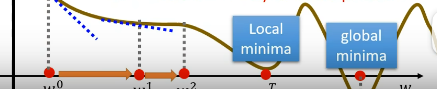
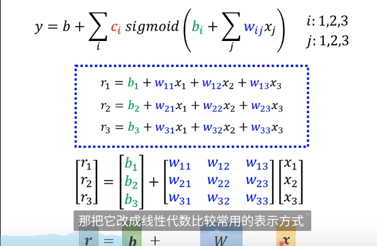

# 机器学习[课程](https://www.bilibili.com/video/BV1YsqSY8EiW?spm_id_from=333.788.videopod.sections&vd_source=6e9d84912f8198d9654970b613a22ba0)

## 7.4日进度

**机器学习初识**

1. 机器学习目标？
   1. 说白了就是人类无法描述清楚的公式，让机器来描述
   2. 一段语音，一张照片，如何识别出文字？如何识别出图片内容？复杂的表达式人无法写出，让机器来构成
2. 任务有什么？
   1. regression(The function outputs a scale)：使用一个函数，输出一个范围，例如给定一些天气参数，预测出明天pm2.5的数值
   2. classification(The function outputs a choose)：给定一些选项，输出一个确定的值
   3. structure learning：让机器输出结构化的东西，也就是创造东西
3. 什么是model？
   1. 对于一个任务，例如预测pm2.5数值，先猜测函数，例如是

      ```mathematica
      y = b + wx
      ```

      x：今日pm2.5数值 ，y：明日pm2.5数值，w作为拟合系数(weight)，b为修正值(bias)，这个函数就叫做一个model
   2. 随后定义一个Loss函数，这个函数的参数就来自上一步骤中的w和b，作用是评价这两个值作为最终结果的话，准不准确？能不能有效预测？用真实的值(label)减去预测的结果，得到每个数据之间的差距，再求和除以个数就是一个简单的Loss值，根据不同wb组合可以得到不同的拟合情况，叫做error surface
   3. Optimization(最佳化)

      1. 利用gradient descent方法，假设把某一个参数掩盖，例如b，然后随即选取w，并计算w对于Loss的微分，微分为正的时候，就减小w，微分为负的时候就增大w
      2. 同时引入N作为learning rate，N和微分结果同时影响w的变化，微分决定方向，N决定变化的速度，N越大，每次w的改变就越大，反之则越小
      3. 什么时候停止更新参数？当参数变化次数达到自设的值，或者微分值为0时停止，但是可能会出现下述情况，当前最优解算作Local minima，全局最优解作为global minima，还没达到最好的情况
   4. 以上这个就叫做训练，将其迁移到多参数上就是考虑多个微分值，然后每个参数进行变化，当一次训练结束后，发现拟合效果并不好，那么根据自己的数据就可以对函数进行更改

## 7.5进度

### 机器学习

**model深入**

1. 普通的linear函数根本无法概括真实曲线
   1. 将曲线结合起来，通过一系列函数将其结合起来，通过判断条件，决定何时采用某个函数结合，理论上任何连续曲线只要点选的足够多，都可以转换成piecewise linear curve，也就是被直线表示出来
      
   2. 利用sigmoid可以进行曲线的模拟，从而得到蓝色曲线的表达式，sigmoid对初始的linear curve取e的负指数，再加上1作为分母，以1为分子并乘系数C得到最后模拟曲线，改变w和b的值可以得到各种各样的曲线
      当wx变成wx的和时，拟合曲线的表达式就可以进行线性代数的转变，转为矩阵的乘法
      

### Latex学习

1. latex所有命令以反斜线\开头
2. 一篇文档主要包括：
   1. \documentclass[UTF-8]{文档类型}，文档类型：article|book|ctexart(中英文混合排版)
   2. \title{}  \author{}  \date{\today}
   3. \begin{document}  \end{document}
3. 常用标记：
   1. \textbf{加粗内容}
   2. \textit{斜体内容}
   3. \underline{下划线内容}
   4. 两个换行符表示新的一段，一个换行符表示空格
   5. 章节标题用\section{内容}，子章节用\subsection{}\subsubsection{}
   6. 引用图片\usepackage{graphicx}，使用图片\includegraphics[width=0.5\textwidth]{file}，\capture{图片标题}\centering居中命令
   7. 列表使用\begin{itemize} \end{itemize}，或者enumerate，每一项应用命令\item 内容

## 7.6进度

### 机器学习

1. 将所有的未知参数均使用线性代数中的向量运算替代，$f=b+w*x$转化为$y=b+c^T*\sigma\left(\overrightarrow b+\overrightarrow w *\overrightarrow x\right)$，将该式子转化为一个参数进行代替$\theta$
2. 上述将model从一个单一参数迁移到了两个参数，随后进行Loss函数的计算，同单一参数一致，将预测的结果同真实结果$\widehat y$计算差值，得到Loss表达式$L=\frac {1}{N}\sum_{n=1}^N e_n $，分别用$L$对每个参数进行偏微分，求得其变化率，最后得到的是gradient，调整到较好的一个状态
3. 三步走：
   1. 选择合适的linear模型，可能是随机的
   2. 设计一个较为贴近的Loss函数
   3. 进行最优化
4. 参数？
   1. 当计算量非常大的时候，如果直接用全部的数据去更新Loss函数的下降，会导致计算量激增，所以将数据分为一份一份的，每份叫做一个$batch$，每个$batch$的大小叫做$batch\_size$，Loss函数的下降就是分开用每一个batch的数据进行更新，当前$batch$更新结束得到$g^1$，下一个$batch$更新得到$g^2$，每一次的更新叫做一个$update$，所有$batch$更新一次过后，叫做一个$epoch$
      hypeparamter指由用户定义的参数，上述参数以及之前的learning rate和sigmoid数量也属于hypeparamter
      这就是模型的部分超参数含义
   2. $ReLU$与$Sigmoid$属于同一类参数，称为$Activation\ function$，前者的函数重叠表达式是$y=c*max(0,b+w*x)$，选取比0大的那一段函数，并且一个$Sigmoid$就需要两个$ReLU$来进行替换，函数如下$y=b+\sum_tc_imax(0,b+\overrightarrow w*\overrightarrow x)$，对所有参数进行第一次处理之后，产生了$a$，为了学习更多特征，就把计算结果当作新的参数，再次进行更新，产生$a'$，这样可以不停的重复学习，迭代的次数就叫做$Layer$，整个迭代过程就叫做$deep\ learning$(7.13日补充)
   3. 当不停的添加layer之后，发现随着损失函数的下降，准确率反而降低了，这个现象就叫做模型的过拟合$overfitting$

## 7.14进度

### 理论学习

1. 模型表现结果不如人意的时候，如何进行调整？
   
2. 如何确定某个函数是不是自己需要的model？先从一些简单的函数实验，也许就会有表现较好的情况，Loss会比较低，然后再去用更深层的deep learning模型，如果发现复杂模型比简单模型的Loss反而更高，就说明最优化方法有问题，没有找到最佳参数，如果发现Loss确实降低了，就说明model bias不够，那继续增加模型的参数，还会带来更好的表现
3. 当训练数据上的Loss确实降低到一个很小的数值之后，再去看测试数据上的Loss表现如何，如果表现的比训练数据大很多，有可能是过拟合或者，如果同样也很小，就说明这个模型比较符合了
4. 过拟合出现的原因是数据对于模型的约束太小，导致模型虽然在某些数据上表现不错，但是一但模型遇到新的未知数据，就会偏离很多，所以最简单的解决过拟合的方法就是增加训练数据
   1. 训练数据有限时，可以采用$Data\ agumentation$，在图像领域就可以把图片进行左右反转，或者截取一部分图片，作为新的数据
   2. 约束模型的参数，假定他的损失函数一定是个二次函数，这样就会限制很大的选择，所以模型就不会胡乱表达
   3. 如何避免使用了测试数据进行训练从而导致某些测试数据非常准确，但是使用到位置的数据上就会表现很差？答案是把训练数据切分成训练集和验证集($validation\ set$)，在训练集上训练完成后，先用验证集验证一下，再去测试集上进行测试，这样最终结果可能会更符合一点
      1. 切分方法：N-fold  Cross validation，将数据切分成n等份，第一次先用最后一份作为validation set，第二次用倒数第二份作为validation，如此重复即可
5. gradient descent方法中，导致gradient为0的点称为$critical\ point$，包括局部最优点和马鞍点，如何判断是最优点还是说$saddle\ point$呢？在该点进行泰勒展开，因为gradient也就是一阶偏导为0，所以泰勒展开就抹去了第二项，这样继续计算，如果后面的一项永远都大于0，那么说明这个点附近的其他点都比他大，这就算最优点，如果都比他小，说明这不是最优点，如果有大有小，那么就不属于任何的点
   1. 以函数$y=w_1w_2x_i$为例，选取$L=(1-w_1w_2)^2$作为损失函数，现在有一个点是critical point，需要判断到底是local min还是saddle point
   2. 先计算一阶偏导，$\frac{\partial L}{\partial w_1}=2（1-w_1w_2）（-w_2）$，$\frac{\partial L}{\partial w_2}=2（1-w_1w_2）（-w_1）$，因为critical point一阶导都为0，所以就需要继续求二阶偏导，$\frac{\partial L^2}{\partial w_1^2}=2（-w_2）（-w_2）$,$\frac{\partial L^2}{\partial w_1\partial w_2}=-2+4w_1w_2$，$\frac{\partial L^2}{\partial w_2\partial w_1}=-2+4w_1w_2$，$\frac{\partial L^2}{\partial w_2^2}=2(-w_1)(-w_1)$
   3. 取参数都为0，得最后的值为0,-2,0,-2，该矩阵特征值为2，-2
      

### 训练过程

1. Batch，每次更新参数时的计算单位，每个batch计算一个gradient，所有batch轮过一次成为一个epoch，当batch_size=N（数据总量）时，参数的迭代比较慢但是会比较准确，当batch_size=1时，参数迭代的会非常快，但是每次迭代的变化比较小，但现在GPU训练都会进行平行计算，就导致大的batch_size和小的计算速度相差极小，而大的batch由于只经过少次计算年年，最后的critical point有可能并不是最好的，并且也许处于一个临界值，就是说左右的损失函数都比该点大，而且大很多，导致模型停留在一个"峡谷"里，这样模型的泛化能力可能表现的会很差

## 7.15进度

### 机器学习

应对critical point:

1. momentum:利用物理的思想，想象参数的下降和小球沿着斜坡滚落是一致的，这样子当小球滚落到一个critical point后，会因为惯性的原因继续往下滚动，能够跳出该点
2. 具体方法：在普通的gradient descent移动上添加新的向量，该向量代表上一次的移动方向
   

学习率调整:

1. 自动调整学习率:当固定使用一个学习率$\eta$时，在不同的位置变化都一致，导致当下降坡度较大时，参数更新也极大，使得直接越过最优点，当坡度极小时，有可能导致移动步幅过小，从而导致损失函数下降几乎不变，所以就需要让学习率自动调整，在坡度较大的地方采用较小的学习率，在坡度平缓的地方采用较大的学习率，这样可以保证损失函数的理想下降趋势
   
2. RMSProp:与上述方法不同的地方在于，$\sigma_i^t$的计算中采用了加权平均，即$\sigma_i^t=\sqrt{\alpha(\sigma_i^t-1)^2+(1-\alpha)(g_i^t)^2}$，可以动态调整$\alpha$，从而能够在坡度不同时调整决定因素是$g$还是$\sigma$
3. 仅此调整还不够，还需要对$\eta$关联时间，让其随着时间变化，有两种调整策略，第一种是decay，也就是衰减，随着训练时间的增加逐步减小，第二种是warm up，最初先慢慢提高，再进行衰减，第二种方法可以让模型先进行一些特征的简单学习

## 7.16进度

### 分类classification

1. 任务是输入的值通过模型处理后，输出一个给定的标签列表中的某一个，关于标签分类问题，由于多数标签并不是完全独立的，可能标签之间互相影响，于是使用$one-hot\ vector$来进行标签的定义，几个标签就有几个向量，每个向量代表一个标签，输出时也需要多次进行计算，向量长度为n，模型就要输出n个$y$，这样才能组成向量$\overrightarrow y$
2. 获得向量结果后，还需要通过$Softmax$进行归一化，输入称为$logit$，输出产生结果与每个标签的相似度$e$，在计算相似度的时候，有两种方法
   1. 第一种是直接使用向量相减的平方和$Mean\  square\ error $，$e=\sum_i(\hat y_i-y_i^" )^2$
   2. 第二种是$Cross-entropy$，计算为$e=-\sum_i\hat y_ilny_i^"$

### 吴恩达课程

**机器学习算法分类**

1. 监督学习（supervised learning）：提供x，输出y的映射算法，经典特征是用户提供正确答案，机器从中学习，从而能够给定一个输入，机器自己输出一个预测值

   1. $Regression\ algorithm$:预测结果来自于无穷无尽的集合中，例如房价的预测
   2. $Classification\ algorithm$:预测结果在给定的选项中产生，结果是一个有限集合
2. 非监督学习(Unsupervised learning)：输入的数据不进行区分，而是由模型自己觉得如何分组，以及分组的类别有多少个。

   1. $clustring\ algorithm $：例如在一组肿瘤大小和良性情况数据集中，监督学习就必须要有标签类别，肿瘤的良性或恶性，无监督学习则不会区分恶性还是良性，他看到的数据都是年龄以及肿瘤大小，再让模型自己去区分标签，模型也许会将这一圈数据分为一组，那一圈分为另一组，这个是特殊的无监督学习
3. 训练集：training set包括feature和traget，通过把训练集提供给模型，模型的功能是根据$x$输出对应的预测值$\hat y$，以线性回归为例，函数被表示成$f(x)=wx+b$，通过决定w和b的值来为x提供预测功能，也成为$univariate\  linear\ regression$（单变量回归函数）

**损失函数**

1. 损失函数可以用来评估模型表现情况，对于最简单的单变量线性回归函数，如何判断某一对参数就是最适合当前情况的？答案是通过计算结果和预测结果之间的距离，也就是损失函数的来源$J=\frac{1}{2m}\sum (\hat y^i-y^i)^2$，对每次选择的参数计算损失后绘制损失函数曲线，能够得到其变化过程，一般损失最小的点所使用的参数是一个比较适合的选择。模型训练的过程其实就是最小化损失函数的过程
2. 梯度下降($Gradient\ descent$):最普遍的最小化损失函数的方法，在最小化过程中会很容易遇到局部最优点，再者参数更新的过程中，应该是更新一个在更新另一个还是同时更新？应该是同时更新，也就是说将更新后的值先赋值给一个中间变量，因为如果直接更新，那么其他参数在进行求导的时候，用到的数不再是旧值了，会影响最优化

## 7.17进度

### 吴恩达机器学习

回顾：

1. 对于简单线性回归函数，剃度下降的公式：$w=w-\alpha\frac{\partial J}{\partial w}$，其中$\alpha$是自己定义的学习率，且面对多个参数时，都需要先分别计算结果后再进行值的更新
2. 机器学习中的监督学习和非监督学习区别在于数据集的定义，监督学习给出了$result$，也就是问题的答案，模型学习如何预测结果，非监督学习并没有给出$result$，而是由模型自己区分数据间的差异性

学习：

1. 批量梯度下降：每次进行参数的更新时，需要计算所有的实例来考虑结果，相当于batch_size=N
2. 学习率$\alpha$的选择：

   1. 过大，每次前进步幅越过收敛点，甚至会导致模型发散
   2. 过小，模型长时间得不到收敛，或者收敛需要很长时间
   3. 最好是能够根据模型当前所处情况进行自动调整，在较为陡峭的地方缩小，较为平缓的地方扩大
3. 多元线性回归：

   1. 参数多，能够共同影响模型结果，如果写成乘积的形式，随着参数变多，函数长度会逐渐增加，所以使用$\overrightarrow w=[w_1,w_2...]$来代表所有的参数，使用$\overrightarrow x=[x_1,x_2...]$来代表所有自变量，这样模型函数就可以写成向量的点积形式，$f_{w,b}(x)=\overrightarrow w\cdot\overrightarrow x+b$来表示，提高阅读效率
4. 向量化：

   1. 即使不使用向量，也能进行乘积的计算，对于手动写出每个乘积，当参数个数增加，代码会很冗长，不利于阅读，对于for循环而言，计算效率比较低

      ```python
      n = 4
      w = np.array([1, 2, 3])
      x = np.array([1, 2, 3])
      b = 4
      f = np.dot(w, x) + b
      "手动列出"
      f = w_1 * x_1 + w_2 * x_2 + b
      "循环列出"
      for j in range(n):
      result = w[j] * x[j]
      result += b
      ```
   2. np.dot的点积运算能够利用设备硬件进行并行计算，效率远比for循环高，所以向量化一方面能够简化代码，另一方面也能够提高运算速度
   3. 对于梯度下降$Gradient\ descent$，向量化也能够提高迭代速度，相比与每个参数求导更新，向量化后，能够同时处理所有参数的求导计算，随后对所有参数同时更改，大大提高了迭代速度

## 7.18进度

### 机器学习

**一元线性回归函数：**

1. 数据生成采用numpy，通过自己设定$w,b$的值生成对应的x和y，在计算y的时候添加噪声，使生成的数据不完全符合方程，模拟数据集

   ~~~python
   import numpy as np
   import matplotlib.pyplot as plt
   np.random.seed(20)
   def generate_data(w_weight, b_weight, n, noise, scale):
     x = np.random.uniform(-10, 10, n)
     y = w_weight * x + b_weight + np.random.normal(noise, scale, n)
     plt.scatter(x, y, label = "data")
     return x, y
   ~~~
2. 生成数据后，下一步应该就是定义模型的损失函数，以及初始化参数，np.mean()函数是一个能够对numpy数组进行计算算术平均值的函数，也能够运用到高阶矩阵中

   ~~~python
   def loss_function(y_true, y_label, n):
     sum_loss = 0
     for i in range(n):
       sum_loss += np.pow((y_true[i] - y_label[i]), 2)
     return sum_loss / n
     """return np.mean(y_true - y_label) ** 2"""
   w = np.random.randn()
   b = np.random.randn()
   n = 100
   ~~~
3. 接下来就是要进行梯度下降的迭代过程，要利用偏导对参数w，b进行更新，理论上可以利用torch的自动求导，但是在这里首先使用手写的方式，对w的偏导结果$\frac{\partial L}{\partial w}=\frac{1}{m}\sum (w*x+b-\hat y)*x$，对b的偏导结果$\frac {\partial L}{\partial b}=\frac{1}{m}\sum (w*x+b-\hat y)$，然后分别更新w和b，直到损失函数的下降幅度小于给定的范围

   ~~~python
   def partial(w, b, x, y):
     w_sum = 0
     b_sum = 0
     for i in range(len(x)):
       w_sum += (w * x[i] + b - y[i]) * x[i]
       b_sum += (w * x[i] + b - y[i])
     return w_sum / len(x), b_sum / len(x)

   def linear_model(epochs, x, y, n):
       w = np.random.randn()
       b = np.random.randn()
       a = 0.01
       loss_list = []
       pre_loss = float("inf")
       stop_scale = 1e-5
       for i in range(epochs):
           y_true = w * x + b
           loss = loss_function(y_true, y, n)
           if(abs(pre_loss - loss) < stop_scale):
               return w, b
           pre_loss = loss
           w_partial, b_partial= partial(w, b, x, y)
           w -= a * w_partial
           b -= a * b_partial
   ~~~
4. 训练完毕后，可以进行损失函数和拟合情况的可视化，能够更好的理解模型训练过程

   ~~~python
   def plot_loss(loss_list):
       plt.plot(loss_list, label = 'loss')
       plt.xlabel('Epochs')
       plt.ylabel('Loss')
       plt.title('Loss over Epochs')
       plt.legend()
       plt.show()

   def plot_model(x, y, w, b):
       plt.scatter(x, y, label = 'data')
       plt.plot(x, w * x + b, color = 'red', label = 'model')
       plt.xlabel('x')
       plt.ylabel('y')
       plt.legend()
       plt.grid(True)
       plt.show()
   ~~~

**matplotlib.pyplot as plt:**

1. 常用函数：
   1. plt.scatter(value，label='example')绘制散点图
   2. plt.plot(x, y, 'string',label='example')绘制直线
      1. x和y是横纵坐标
      2. string是格式化字符串，结构是color-marker-line

         1. color包括blue，red等等
         2. marker是指标记字符：
            1. `'.'`: point marker 点标记
            2. `','`: pixel marker 像素标记
            3. `'o'`: circle marker 圆形标记
            4. `'v'`: triangle\_down marker 向下三角形标记
            5. `'^'`: triangle\_up marker 向上三角形标记
            6. `'<'`: triangle\_left marker 向左三角形标记
            7. `'>'`: triangle\_right marker 向右三角形标记
            8. `'s'`: square marker 正方形标记
            9. `'p'`: pentagon marker 五边形标记
            10. `'*'`: star marker 星号标记
            11. `'h'`: hexagon1 marker 六边形标记1
            12. `'H'`: hexagon2 marker 六边形标记2
            13. `'+'`: plus marker 加号标记
            14. `'x'`: x marker X 标记
            15. `'D'`: diamond marker 菱形标记
            16. `'d'`: thin\_diamond marker 细菱形标记
            17. `'|'`: vline marker 竖直线标记
            18. `'_'`: hline marker 水平线标记
         3. line是指线的形状:
            1. `'-'`: solid line style 实线
            2. `'--'`: dashed line style 虚线
            3. `'-.'`: dash-dot line style 点划线
            4. `':'`: dotted line style 点线
   3. plt.xlabel/ylabel()绘制横纵坐标
   4. plt.legend()显示图例
   5. plt.grid(True)显示网格
   6. plt.title()设置标题

多元线性回归函数：

1. 针对多元问题，要搞清楚多元中的数据集组成是什么样的，特征权重的数量同自变量的数量保持一致，所以在数据生成上，需要完成多组数据的生成，绘制3D图形利用mpl_toolkits.mplot3d中的Axes3D，numpy.random的uniform函数，最后一个参数可以传入矩阵的行列数，甚至是更高维度的参数

   ~~~python
   def generate_data(w_weight, b_weight, n):
       """
       w:[1, 2, 3]
       x[1]:[x1, x2, x3]
       """
       x = np.random.uniform(-5, 5, (n, 3))
       y = np.dot(x, w_weight) + b_weight   + np.random.normal(0, 0.5, n)
       fig = plt.figure()
       ax = fig.add_subplot(111, projection='3d')
       sc = ax.scatter(x[:, 0],x[:, 1],x[:, 2],c = y, cmap = 'viridis')
       plt.colorbar(sc)
       plt.show()
       return x, y
   ~~~
2. 损失函数与一元回归保持相同
3. 模型迭代函数中，先设立初始的w参数和b参数，随后进行y的预测，再根据损失函数计算差值，随后对$\overrightarrow w$中每个参数进行偏导计算，较为复杂

   ~~~python
   def model_train(x, y, epochs, n):
     w = np.random.uniform(-1, 1, 3)
     b = np.random.randn()
     y_predict = np.dot(x, w) + b
     loss_list = []
     pre_loss = float(int)
     for i in range(epochs):
       loss = loss_function(y_predict, y)
       w_partial, b_partial = partial(w, b, x, y, n)
       w -= w_partial
       b -= b_partial
       if(abs(pre_loss - loss) < scale):
         break;
       loss_list.append(loss)
       pre_loss = loss
     return w, b, loss_list
   ~~~
4. 偏导的计算，首先要弄清楚每个参数的表达式，损失函数$L=\frac{1}{2n}\sum_{i=1}^n (w_1x^i_1+w_2x_2^i+w_3x_3^i+b-\hat y) ^2$，对于$w_1$，求得偏导结果为$\frac{\partial L}{\partial w_1}=\frac{1}{n}\sum_{i=1}^n (w_1x^i_1+w_2x_2^i+w_3x_3^i+b-\hat y)x_1^i$，$w_2,w_3$同理

   ~~~python
   def partial(w, b, x, y, n):
     w_1 = 0
     w_2 = 0
     w_3 = 0
     b_partial = 0
     for i in range(n):
       error = np.dot(x[i],w) + b - y[i]
       w_1 += error * x[i][0]
       w_2 += error * x[i][1]
       w_3 += error * x[i][2]
       b_partial += error
     return [w_1 / n, w_2 / n, w_3 / n], b_partial / n
   ~~~

## 7.19日进度

### 机器学习课程

1. 特征缩放：对于房价预测，倘若房屋尺寸分布在80-100平米，卧室数量分布在1-4个，该如何确定参数的大小？如果房屋尺寸的参数过大，那么最终结果一定是偏大的数值，且卧室数量起不到影响作用，假如有参数为0.5和10，应当把0.5分配给房屋尺寸，10分配给卧室，这叫做特征缩放
2. 步骤：确定好每个数据的取值范围，例如$80<x_1<100,1<x_2<4$，接下来就是对数据进行缩放，
   1. 第一种缩放操作要根据数据的上限，使用数据/最大值求得分布范围，$0.8<x_{1,scale}<1,0.25<x_2<1$
   2. 第二种是均值归一化，使得数据分布在四个象限，首先计算出每个数据的均值$\eta$，随后采用公式$x_i=\frac {x_i-\eta}{max-min}$，对所有数据作处理
   3. Z-score归一化，计算出均值和标准差$\eta,\sigma$，套入公式$x_i=\frac{x_i-\eta}{\sigma}$，最后就可以进行缩放了

## 7.21日进度

### 机器学习课程

1. 学习率的选择：
   1. 过大，在收敛点附近来回振荡，甚至可能越来越远离收敛点；过小，又会收敛的速度非常慢。当遇到收敛函数不下降甚至增大的情况，这个时候就考虑是不是选择了过大的学习率，将学习率缩小到一个极小值，查看收敛函数是否下降，如果随着每次的迭代就减小，说明模型的代码没有问题，如果发现很小的学习率下，收敛函数还上升，就要考虑代码编写问题了
   2. 如何找到比较适合的学习率：从0.001->0.01->0.1逐渐尝试，增大的过程中可以放大三倍再次尝试，0.001->0.003->0.01->0.03->0.1->0.3，基本就可以找到一个比较合适的学习率
2. 特征工程：
   1. 对于房屋预测，若有长和宽两个因素，第一种是直接作为两个特征处理，$f=w_1x_1+w_2x_2+b$，但是这样处理可能两个因素的联系不够紧密，或许面积更能表达房屋的大小，那么就设置出第三个特征$x_1x_2$，最终的f就变为$f=w_1x_1+w_2x_2+w_3x_1x_2+b$，通过转换或者结合原始特征，让问题处理更加精准
3. 多项式回归：
   1. 结合多元线性回归和特征工程，提出了多项式回归方法，可以拟合曲线和非线性函数，但是这个对于数据的缩放要求也更高，不然会出现决定因素基本没有影响的情况(scikit-learn开源机器学习库)
      
4. 逻辑回归
   1. 不同于线性回归，逻辑回归预测的结果是类别，而不是无限的取值，无论多大的值，都可以转换为0-1的概率分布，依赖的是$Sigmoid$函数，对于值$z$，$g(z)=\frac{1}{1+e^{-z}}$，当z很小时，分母较大，输出的概率也就比较小，当z很大时，分母趋近于1，输出的概率也比较大，一种表示结果的描述是$f_{\overrightarrow w,b}(\overrightarrow x)=P(y=1|x;w,b)$，其中x代表输入的参数，分号后代表参数parameter，逻辑回归的拟合需要用到高阶多项式，尤其是图形极不规则时，或者内圆是一个类别，外圆是一个类别，就比较适合平方的和。
   2. 决策边界是判定最终结果为哪个类别的边界值，例如当概率达到百分之70时，就是类别1，小于百分之70时，就是类别2，那么这个百分之70就算决策边界
   3. 损失函数：如果仍然使用标准差来进行计算，损失函数的曲线会是跌宕的下降，如果使用梯度下降，很容易陷入局部最优点，导致模型表现不佳，于是采用以下的损失函数：L作为单个样本的损失函数，以下选取的函数来自于统计学中最大似然估计
      1. $L(f_{\overrightarrow w,b}(x^i),y^i)=\{_{-log(1-f_{\overrightarrow w,b}(x^i))\ y^i=0}^{-log(f_{\overrightarrow w,b}(x_i))\ y^i=1}$，为什么这个L更适合作为逻辑回归的损失函数？
      2. 当$y^i=1$时，随着f的输出值越大，那么整体的L就越接近0，这就符合了类别为1时，预测的概率也应该更大，而且是越接近于1越好，当f很小时，说明只有很小的概率预测结果是1，而现在已知结果就是1，那么损失就很大
      3. 当$y^i=0$时，随着f的输出越小，那么预测为1的可能性就越小，就意味着大概率是0，所以损失比较小，反之损失就比较大。
      4. 逻辑回归的损失函数，也要把所有样本的同步加起来，最后除以个数，就得到了最终的$J$
      5. 简化版的损失函数：$L(f_{\overrightarrow w,b}(x^i),y^i)={-log(1-f_{\overrightarrow w,b}(x^i))\ y^i}{-log(f_{\overrightarrow w,b}(x_i))(1-y^i)}$
   4. 逻辑回归的梯度下降和线性回归表达一致，同样也可以进行特征缩放，向量化等等操作
5. 过拟合：
   1. 泛化$generalization$：训练后的模型在新的数据集上表现也比较良好，甚至是运用到完全未接触的数据上来进行预测。
   2. 高偏差$high\ bias$：模型不能拟合数据集，或者说不能较好的拟合数据集
   3. 高方差$high\ variance $：模型虽然在数据集上的所有样本都表现很好，但是他表现的太好了，以至于尽管损失函数很低，但是模型可能非常杂乱，只要用一个新的数据，模型可能会预测的相差十万八千里。

## 7.22日进度

### 机器学习

1. 过拟合问题的解决：
   1. 最简单的就是添加更多的训练数据，涵盖多方面
   2. 减少使用的特征数量，称为特征选择，选取最有用的特征子集来进行训练
   3. 正则化(Dropout)：相比于直接删除参数，正则化则是会减小参数的大小，使得其影响较小，同时又不损失特征的作用，并且一般只会缩小参数$\overrightarrow w$，不会对b进行更改
2. 手写逻辑回归:
   1. 首先定义好生成数据的函数，包括数量，参数大小

      ~~~python
      def generate_data(w, b, n):
        x = np.array([np.random.uniform(50, 100, n), np.random.uniform(1, 3, n), np.random.uniform(500, 2000, n)])
        x = np.array([x[0], np.array[[i*i for i in x[1]]], np.array[[x[1][i]*x[2][i] for i in range(len(x[2]))]]])
        y = np.dot(x.T, w) + b + np.random.normal(0, 5 ,n)
        y = 1 / (1 + np.exp(-y))
        for i in range(len(y)):
          if y[i] > 0.7:
              y[i] = 1
          else:
              y[i] = 0
        plt.scatter(x[0], y, label = 'x_1_y')
        plt.legend()
        plt.xlabel('x_1')
        plt.grid(True)
        plt.show()
        return x, y
      ~~~
   2. 其次编写逻辑回归的损失函数，$L_{\overrightarrow w, b}（\overrightarrow x）=-y_ilog(f_{\overrightarrow w,b}(\overrightarrow x))-(1-y_i)log(1-f_{\overrightarrow w,b}(\overrightarrow x))$，根据此方程进行计算

      ~~~python
      def loss_function(y_true, y_label):
          loss_sum = 0
          for i in range(len(y_true)):
              Loss = -y_label[i] * np.log(y_true[i]) - (1 - y_label[i]) * np.log(1 - y_true[i])
              loss_sum += Loss
          return loss_sum / len(y_true)
      ~~~
   3. 随后编写梯度下降的训练过程

      ~~~python
      def train_model(x, y, epochs, n):
        w = np.random.uniform(-100, 100, 3)
        b = np.random.randn()
        loss_list = []
        pre_loss = float('inf')
        step = 1e-5
        for i in range(epochs):
            y_prob = np.dot(x.T, w) + b
            loss = loss_function(y_prob, y)
            if(abs(loss - pre_loss) < step):
              break
            loss_list.append(loss)
            w, b = update_para(w, b, x, y, y_prob)
            pre_loss = loss
        return loss_list
      ~~~

## 7.23日进度

### 机器学习

1. 接着继续完成逻辑回归的偏导计算$\frac{\partial L}{\partial w_1}=(f-y)x_1,f=\frac{1}{1+e^{-z}},z=w_1x_1+w_2x_2^2+w_3x_2x_3+b$

   ~~~python
   def partial(x, y, y_prob):
       sum_1 = 0
       sum_2 = 0
       sum_3 = 0
       sum_b = 0
       y_exp = 1 / (1 + np.exp(-y_prob))
       for i in range(len(y)):
           sum_1 += (y_exp[i]-y[i]) * x[0][i]
           sum_2 += (y_exp[i]-y[i]) * x[1][i]
           sum_3 += (y_exp[i]-y[i]) * x[2][i]
           sum_b += (y_exp[i]-y[i])
       return np.array([sum_1 / len(x[0]), sum_2 / len(x[0]), sum_3 / len(x[0])]), sum_b / len(x[0])

   ~~~

## 7.24进度

### 机器学习

1. generate_data()输出的y值基本全部都是1，这和sigmoid有原因，当$-5<z<5$时，可以比较好的处理概率问题，当z的绝对值超过5时，整个sigmoid函数基本都会趋近于1，所以使得结果没区别故需要进行特征缩放，采用z-score归一化

   ~~~python
   def generate_data(w, b, n):
     x = np.array([np.random.uniform(50, 100, n), np.random.uniform(1, 3, n), np.random.uniform(500, 2000, n)])
     x = np.array([x[0], [i*i for i in x[1]], [x[1][i]*x[2][i] for i in range(len(x[2]))]])
     x_1_E = averge(x[0])
     x_2_E = averge(x[1])
     x_3_E = averge(x[2])
     x_1_d = de(x[0], x_1_E)
     x_2_d = de(x[1], x_2_E)
     x_3_d = de(x[2], x_3_E)
     for i in range(len(x)):
       for z in range(len(x[i])):
           if i == 0:
             x[i][z] = (x[i][z] - x_1_E) / x_1_d
           elif i == 1:
             x[i][z] = (x[i][z] - x_2_E) / x_2_d
           else:
             x[i][z] = (x[i][z] - x_3_E) / x_3_d
     y = np.dot(x.T, w) + b + np.random.normal(0, 5 ,n)
     y = 1 / (1 + np.exp(-y))
     for i in range(len(y)):
       if y[i] > 0.7:
           y[i] = 1
       else:
           y[i] = 0
     plt.scatter(x[0], y, label = 'x_1_y')
     plt.legend()
     plt.xlabel('x_1')
     plt.grid(True)
     plt.show()
     return x, y
   ~~~
2. 接着定义均值和方差函数

   ~~~python
   def averge(x):
      sum = 0
      for i in range(len(x)):
         sum += x[i]
      return sum / len(x)
   def de(x, x_averge):
      sum = 0
      for i in range(len(x)):
         sum += (x[i] - x_averge) ** 2
      return np.sqrt(sum / len(x))
   ~~~
3. 正则化

   1. 当特征过多时，容易发生过拟合，比较大的参数会主导曲线，为了让模型拟合一个更加平滑的曲线，也更为了缩小部分特征对训练的影响，使用正则化，将参数添加到损失函数中$\frac{\lambda}{2m}\sum w_j^2$，$\lambda$代表了该项对于损失函数的影响程度，由自己决定，这样既可以追求损失的最小化，也可以追求参数的最小化
   2. 线性回归的损失函数如下$w_j = w_j-\alpha[\frac{1}{m}\sum (f_{\overrightarrow w,b}(x_i)-y_i)+\frac{\lambda}{m}w_j]=(1-\alpha\frac{\lambda}{m})w_j-\frac{\alpha}{m}\sum (f_{\overrightarrow w,b}(x_i)-y_i)$，可以看到每次的正则化部分其实就是让w乘一个稍微小一点的数，这样就能够起到缩小的作用
   3. 逻辑回归同上

# 暑期进度

1. 完成机器学习的神经网络和强化学习等课程内容
2. 完成xv6

## 7.30进度

### 神经网络学习

1. 最开始是为了模仿人类大脑进行工作
2. 后来发现普通的机器学习模型随着数据量提升，性能也不会有过高的增加，意味着上限较低，利用神经网络能够随着数据的增加提高性能
3. $neuron$神经元：可以理解为大脑神经网络中一个最简化的模型，将线性回归或者逻辑回归的输出当作$a$，意为activation_values，对于一件衬衫，它本身的特征可能有$Price\ Shipping cost\ Marketing \ material$，这些属性决定衬衫的一系列品质，而一个消费者可能会在意衬衫的$Affordability\ awareness \ quality$，正常情况下可能会直接将衬衫的特征作为自变量而进行预测衬衫被购买的可能性，现在可以将价格和购物消费作为购买力的输入，市场作为知名度的输入，材质和价格作为质量的输入，这样就有三个神经元位于消费者特征前，再将这三个特征作为输入得到最后的预测概率，这样一来，消费者前面的三个神经元就被称为一个$Layer$，其中的购买力、知名度、质量就称为$Hidden\ Layer$也叫，最后的一层称为$Input\ Layer$输出层，隐藏层的意义就是在数据集中你并没有购买力等这些值，只有输入的x和输出的y
   
4. 当一个神经网络拥有很多层的时候，逐个神经元进行特征选择是非常耗时间的，所以在实际工作中通常会让所有神经元接受前一层的输入，然后通过设置参数来决定使用什么特征，这就是隐藏层的真正作用，这也叫做多层感知器
   1. 对于一个包含一层隐藏层的神经网络，输入是$\overrightarrow x$，隐藏层的每个神经元都包含一个$w_i^j,b_i^j$代表当前第j层隐藏层的第i个神经元对应的参数，每个神经元进行逻辑回归的拟合$g(z)=\frac{1}{1+e^z},z=w_i^j\overrightarrow x+b_i^j$之后，得到一个输出向量$\overrightarrow a^1$，这就是第一层的输出值，随后作为第二层也就是$Input\ Layer$的输入，继续进行同样的操作得到输出结果$a^2$
   2. 说明一个n层的神经网络时，通常指的是他有n-1层的隐藏层和一层输出层，而激活函数一般就是指$Sigmoid$函数
   3. 在一个真正的神经网络中，将输入值作为$\overrightarrow a^0$输入，从而得到$\overrightarrow a^1$一直到结果的过程叫做前向传播，是一个激活的过程
5. Python中数据的表示
   1. numpy中数据

      ~~~python
      np.array([100,200,300])"表示的是一维数组"
      np.array([[200]])"这是一个二维数组，只有一个值"
      np.array([200],[400])"这是一个2x1的矩阵"
      np.array([200,400][100,300])"这是一个2x2的矩阵"
      a1 = Dense(units = 25, activation = "sigmoid")
      print(a1)"将会输出tf.Tensor()"
      a1.numpy()"可以将其从tensorflow的向量数据形式转化为numpy的矩阵表达"
      ~~~

## 7.31进度

### 机器学习

1. 构建一个神经网络

   ~~~python
   import tensorflow as tf
   import numpy as np
   x = np.array([
       [220, 17],
       [250, 21],
       [120, 12],
       [212, 18]
   ])
   y = np.array([1, 0, 0, 1])
   layer_1 = tf.keras.layers.Dense(units = 3, activation = 'sigmoid',input_shape = (2,))
   layer_2 = tf.keras.layers.Dense(units = 1, activation = 'sigmoid')
   model = tf.keras.Sequential([layer_1, layer_2])
   model.compile(optimizer = 'adam', loss = 'binary_crossentropy', metrics = ['accuracy'])
   model.fit(x, y, epochs = 1000, verbose = 1)
   predictions = model.predict(x)
   for i in range(len(predictions)):
       print(f'Input: {x[i]}, Predicted: {predictions[i][0]:.4f}, Actual: {y[i]}')
   ~~~

## 8.1进度

### 机器学习

1. 使用高效的机器学习库例如tensorflow或者Pytorch，但是也应当理解代码的背后原理

   1. 对于一个2层的神经网络，通过编写函数可以避免逐个神经元代码编写

      ~~~python
      import tensorflow as tf
      import numpy as np
      def dense(a_in, W, b):
          units = W.shape[1]
          a_out = np.zeros(units)
          for j in range(units):
              w = W[:,j]
              z = np.dot(w, a_in) + b[j]
              a_out[j] = sigmoid(z)
          return a_out
      W = np.array([
          [1, -3, 4],
          [2, 5, 7]
      ])
      b = np.array([1, 2, 3])
      x = np.array([-2, 4])
      def Sequential(x):
          a1 = dense(x, W1, b_1)
          a2 = dense(x, W2, b_2)
          f_x = a_2
          return f_x
      ~~~
   2. 更加高效的执行方式？matmul是指$matrix\ multiplication$，并且传入的矩阵必须严格按照有效顺序，不然会无法计算，保持前一个矩阵的列数是后一个矩阵的行数，python内置的矩阵乘法运算符是@

      ~~~python
      def dense(a_in, W, B):
          Z = np.matmul(a_in, W) + B
          f_x = Sgimoid(Z)
      W = np.array([
          [-1, 3, 4],
          [2, -5, 6]
      ])
      B = np.array([[2, 1, 3]])
      a_in = np.array([[-1, 4]])
      ~~~
2. 使用tensorflow进行模型的训练

   ~~~python
   from tensorflow.keras.layers import Dense
   from tensorflow.keras.losses import BinaryCrossentropy
   from tensorflow.keras import Sequential 
   x = np.array([
     [200, 12],
     [250, 27],
     [120, 10]
   ])
   y = np.array([1, 0, 0])
   model = Sequential([
     Dense(units=3, activation='sigmoid', input_shape=(2,)),
     Dense(units=1, activation='sigmoid')
   ])
   model.compile(loss=BinartCrossentropy())
   model.fit(x, y, epochs=100)
   ~~~
3. 训练流程与普通回归模型也一致，首先定义函数本身，随后确定好需要使用的损失函数，最后开始梯度下降
4. 针对分类任务，损失函数$BinaryCrossentropy$，也叫做二元交叉熵，表达式就算是逻辑回归中的损失函数$L（f(x),y）=-ylog(f(x))-(1-y)log(1-f(x))$的函数，针对回归任务，可以使用最小化平方误差，名为$MeanSquareError$

## 8.2进度

### 机器学习

1. 激活函数的替代：$Relu$，$\{^{z<0,Relu(z)=0}_{z>0,Relu(z)=z}$，这就是Relu的表达式，以及线性激活函数也就是不改变值
2. 激活函数的选择：
   1. 面对二分类问题，最好选择$Sigmoid$函数
   2. 面对变化值的预测，因为有正有负，最好选择线性激活函数
   3. 面对某些非负的数值，选择$Relu$
   4. 相比sigmoid，relu不仅计算更加快速，并且也能加快梯度下降的速度，而sigmoid在两端都是平缓的，所以现在大部分神经网络的隐藏层都采用relu激活函数
3. 多类问题：目标不再是两个分类结果，而是三个四个以上的，通过$Softmax$而不是$Sigmoid$能够解决输出多个分类概率的问题
   1. $Softmax$：计算方法，对于每个类别的不同分类计算结果，$Sigmoid()=\frac{e^{z_i}}{\sum _{i=1}^{N}e^{z_i}}$，这样就做到了概率和为1

## 8.3进度

### 机器学习

1. 多类别分类问题：

   1. 应用softmax和其他激活函数不同，softmax使用了上一层所有的输出，而其他激活函数例如$Sigmoid,Relu$仅仅使用了当前输出值对应的上一层某个输出，例如$a_1$来自于$z_1$等等
   2. 使用softmax在代码中应当修改为

      ~~~python
      Dense(units=10, activation='softmax')
      ~~~
   3. 同时对应编译的损失函数也需要改为稀疏类别交叉熵损失函数

      ~~~python
      model.compile(SparseCategoricalCrossentropy())
      ~~~
   4. 在计算机中$x=\frac{2}{10000}$与$x=\frac{1}{10000}+\frac{1}{10000}$结果并不相同，通过输出小数点后18位能发现，分开的和结果为0.199999978，所以直接使用之前的代码段容易提升误差，为了减小误差，改变以往$a=g(z)=\frac{1}{1+e^{-z}},L=-ylog(a)-(1-y)log(1-a)$直接使用$L=-ylog(\frac{1}{1+e^{-z}})-(1-y)log(1-\frac{1}{1+e^{-z}})$能够提高精度，减小误差

      ~~~python
      model.compile(loss=BinaryCrossentropy(from_logits=True))
      ~~~

      对比softmax的神经网络，如果把$a_i=g(z_i),L=-log(a_i)$计算出来，误差会提升，因为log函数，会将数据之间的差异性放大，log函数在不同的x区间上变化幅度不一致，所以在传入最后概率的计算时，直接将z值传入到损失函数而不是先计算一层，如$L=-log(\frac{e^{z_1}}{e^{z_1}+e^{z_2}+e^{z_3}})$，代码需要做以下修改

      ~~~python
      model=Sequential([
          Dense(units=25, activation='relu'),
          Dense(units=10, activation='linear')
      ])
      model.compile(loss=SparseCategoricalCrossentropy(from_logits=True))
      logits = model(X)
      f_x = tf.nn.softmax(logits)
      ~~~
2. 多标签分类问题：对于一张马路图片，里面可能包括行人，公交，汽车，这个时候每个图片对应的数据就不是单一的一个结果了，对于数字识别0-9，每个图片仅仅有可能是其中的一个数字，但是对于一张马路照片，可能同时包含汽车，行人，马路，这个时候的结果$y=[1, 0, 1]$就是一个向量而非单一的0和1
3. 更快速的梯度下降方法：$Adam$，自适应动量估计，通过观察损失函数下降的速度和步伐动态调整学习率，并且每个参数的学习率都不一样，当下降缓慢时，且变化不大，增大学习率，下降振荡明显，缩小学习率

   ~~~python
   model.compile(optimizer=tf.keras.optimizers.Adam(learning_rate=1e-3),loss=tf.keras.losses.SparseCategoricalCrossentropy())
   ~~~
4. 卷积层$Convolutional\ layer$是神经网络中一个经常使用的隐藏层，是指通过限制模型观察到的数据，例如对于一张图片，只观察一部分区域而不是整张图片作为第一个神经元的输入，第二个神经元类似，始终保持获得数据的一部分，这样做的好处是能够有效加快计算时间，同时也能避免过拟合，降低了数据的需求量。同时后面隐藏层也不会接受前一层所有的输出，而是选择一部分作为输入，这样的计算甚至可能会比之前的密集层更加高效
5. 训练完毕后模型评估：

   1. $min(Loss)$，看是否能够达到损失函数最小
   2. $training\ data\ error$，训练集上的损失
   3. $test\ data\ error$，测试集上的损失
   4. 对于二分类问题，可以利用标签正确的比例进行判断
6. 如何选择一个更适合自己算法的模型？比如如何选择多项式的最高阶数

   1. 首先数据集划分不再是8：2的训练集：测试集，而是6：2：2的训练集：交叉验证集$Cross\ validation(dev \ set)$：测试集
   2. 根据自己需求的区间，将区间内每个类型的参数均通过训练集进行训练，随后计算每个模型在交叉验证集上的损失大小，选择最小的那个，如果需要了解模型的泛化能力，就使用测试集$test\ data$进行损失的计算来代表最终的泛化效果。
7. 诊断偏差$high\ bias$或者方差$high\ variance$

   1. 计算$J_{train}$和$J_{test}$，如果都高，说明是高偏差，参数本身就不拟合，如果$J_{train}$比较低，但是$J_{test}$比较高，说明高方差，模型过拟合，如果都低，说明模型比较合适了
   2. 如何利用正则化来进行方差和偏差的优化，正则化系数$\lambda$很小时，对于w的影响几乎不存在，所以当$J_{train}$比较小，对应的$J_{test}$可能会过大，当$\lambda$很大时，模型几乎会把参数设置为0，那么不管是$J_{train}$还是$J_{test}$都会很大，绘制出来的图像就和横轴为$degree\ of\ polynomial$的图像保持对称
8. 表现基准

   1. 并不能完全要求一个模型表现的非常好，如果是人类都无法很好的完成的情况下，通过与人类水平比较，其他模型比较，以及基准实验来衡量模型效果，并不能简单的通过损失判断模型优劣
   2. 通过学习曲线也能比较直观的表现出模型的效果如何
      1. 对于一个正常表现的模型，随着数据集的增大，模型的$J_{train}$会从小逐渐增大，随后保持一个比较平缓的增长速度，$J_{test}$会从比较大逐渐下降到一个区域然后保持一个平缓的下降速度。
      2. 对于$High\ bias$的模型，也是类似的表现，但是损失渐近线会更高，同时损失达到这个线的速度也会极快，也就是模型已经完全失效了，数据再多也没用了
      3. 对于$High\ variance$的模型，也许$J_{train}$会比基准表现还要低，同时与$J_{test}$之间还会存在很远的距离，而基准表现就在两者之间，但是随着数据的增加，最后两者会回到一个正常表现的模型
9. 应用后评估，如何进行模型的调整？发现应用到实际当中的模型出现了高方差或者高偏差的问题，如何进行改进？

   1. 增加更多的数据集->可以改进$High\ variance$
   2. 使用特征的子集->可以改进$High\ variance$
   3. 使用更多的特征->可以改进$High\ bias$
   4. 特征工程->可以改进$High\ bias$
   5. 增大$\lambda$->可以改进$High\ variance$
   6. 减小$\lambda$->可以改进$High\ bias$】
10. 日常生活中遇到高方差或者高偏差问题该怎么办？

    
11. 正则化对于模型几乎没有坏处，一个大的神经网络模型通过正则化训练能够达到小网络的效果，代码中添加正则化只需要添加参数`kernel_regularizer=0.01`

## 8.4进度

### 机器学习

1. 如何建立一个神经网络系统？选择合适的模型、数据->进行训练->根据方差偏差和错误进行分析->进行参数的调整等等措施->重新回到第一步再次训练
2. 如何进行错误分析？假设模型在某些样本上表现不好，可以取出一部分分类错误样本，观察这些样本之间存在什么联系，或者都有什么共同表现，以垃圾邮件为例，这些邮件是不是都有故意拼错单词？或者都有共同的单词，或者都是关于共同领域的。总体上就是通过手动检查错误例子，进而决定模型需要在什么方面改进
3. 数据增强$Data\ Augmentation$，利用现有的例子去创建新的数据，例如音频识别中，通过添加噪声或者增加失真，来创建一个新的音频数据，在图像识别中，通过截取一部分原图或者通过手动编码创建类似的图像作为新数据
4. 迁移学习$Transfer \ learning$，通过在其他应用上训练过的模型，更改模型输出层神经元数量从而进行所需数据的训练，
   1. 例如现在需要训练识别0-9，但是有个数据集是关于猫狗以及动物类的，类别有1000种，那么就先在这个数据集上训练好参数，随后将最后一层神经元数量改为10，然后最后一层参数初始化，利用现在的数字识别数据集进行训练
   2. 有两种训练方式，第一种是不改变前面隐藏层的参数，直接固定，只让损失函数对最后一层输出层参数进行迭代。第二种是前面隐藏层参数也正常进行迭代，以此进行迁移学习。
   3. 上述做法的第一步就叫做有监督预训练$Supervised\ pretraining$，第二步就叫做微调$Fine\ tuning$，为什么这样能够起到效果？因为第一步的预训练模型在第一层可能是发现图像边缘，下一层是连接线条，这些特征的学习对于识别人物都有效果，所以不管是猫狗还是数字都可以起到比较好的作用
   4. 这样的训练过程必须保证输入的数据都是同类型的，不能将音频识别的模型用于图像领域的微调
5. 一个完整的机器学习项目周期包括什么？
   1. 确定项目范围，具体的是模型用来做什么任务？
   2. 搜集需要使用的数据集或者自己进行数据集建立
   3. 训练模型，并不断优化或者添加数据，包括$bias,variance,error$的分析，直到模型效果达到自己的要求
   4. 部署到实际的系统当中，当性能下降时对其进行调整，或者发现模型缺失某些学习特征时，重新进行训练
6. 数据倾斜的数据集如何进行结果评价？
   1. 准确率：被预测正确的正例占所有预测为正的正例的多少？一个人被预测为有病，那他真正患病的概率
   2. 召回率：被预测正确的正例占实际上真正是正例的多少？一个人真正有病，他被检测出来的概率
   3. 在预测中，阈值一般被设置为0.5，实际上一般疾病的预测，高于一个大于0.5的数字才会被确定为正，所以这个时候精确率$Precision$提高了，因为判断为正的例子更有可能是患病的，但是召回率$Recall$降低了，因为原本被预测为正的例子现在可能不会被预测了，导致召回率的分子降低
   4. F1分数：为了避免准确率和召回率相差过大的影响，不使用二者的平均而是通过F1分数来计算，f1分数更强调结果偏向于小的那个值，而不是受到大的值影响$F1=2\frac{1}{\frac{1}{R}+\frac{1}{R}},F1=2\frac{PR}{P+R}(调和平均harmonic)$
7. 决策树：通过数据结构中的树，为每个路径都设置条件，代表如何继续往下走，叶子节点是结果，途中的内部节点代表每个特征，每个内部节点的子树代表不同的特征路径
   

## 8.5进度

> 机器学习第二部分完结，准备进入高级算法

### 机器学习

1. 决策树
   1. 内部节点要尽量能够让左右子树分类清晰，例如左侧一定全是符合某个特征，右侧一定不符合，最大化纯度
   2. 停止的时机
      1. 当一个节点全部都满足要求时不再细分
      2. 当继续拆分时导致树会超出最大深度
      3. 当拆分节点带来的纯度增长没有达到预期时也不再拆分
      4. 当某个节点的数量小于阈值时也不再拆分
   3. 熵$entropy$：衡量节点内部纯度的函数，$H(p_1)=-p_1log_2(p_1)-(1-p_1)log_2(1-p_1)$，与逻辑损失函数类似
      
   4. 信息增益$information\ gain$：熵的减少，先计算出子结点的熵，再通过加权平均计算出分支的代表熵，计算公式$H=(the \ number\ of\ left\ node)H(p_{left})+(the\ number\ of\ right\ node)H(p_{right})$，将父节点的熵值减去加权平均后的子结点熵，就是最后的比较结果，选择最大熵的减少程度
   5. 独热编码$one-hot\ encoding$，如果一个特征可以取得两个以上的离散特征值，为将其所有的可能性各自拆分为一个特征，原本有K个取值的特征现在变成了K个不同的特征
   6. 对于连续的特征值独热编码无法起效，但是可以通过设置阈值，来区分左右，阈值的选择也需要考虑信息增益的大小，根据能够带来最大增益的阈值进行分别，例如10个动物以体重划分，若以8kg为阈值，左子树分到两个猫，右侧有三个猫和五个狗，此时的信息增益就是$F=H(\frac{5}{10})-(\frac{2}{10}H(\frac{2}{2})+\frac{8}{10}H(\frac{3}{8}))$，不停的以不同的阈值进行计算，最后选择结果最大的
2. 回归树
   1. 回归树和线性回归模型类似，都是预测一个值，而不是二分类，并且每个内部节点的特征选择也不同于决策树，回归树要求子结点拥有最小的结果方差
   2. 首先计算子结点的方差$v_{left},v_{right}$，随后计算每个子结点占父节点的份额$w_i$，同样计算父节点方差$v_i^p$，计算方差缩小值为$w_i^p-(w_{left}v_{left}+w_{right}v_{right})$，选择最大缩小值的分类结果
   3. 每个叶节点预测结果是其均值
3. 多决策树，利用多个决策树进行结果的预测，因为单一的决策树很容易受到样本的影响，所以利用多个决策树同时预测，最后选择投票多的
   1. 多决策树需要利用到有放回抽样，以此来构建一个不同于初始训练集的新训练集
   2. 随即森林算法：利用有放回抽样构建新的数据集，然后利用每个创建的数据集进行一次树的训练，这样随着树的增加，最后就会得到庞大的树，但是这样执行的结果可能会导致许多树并没有较大的差异，也许根节点甚至没有改变，所以在每次训练新的决策树前，会决定模型从哪些特征中选择作为内部节点，比如特征总数为100，模型可能会约束在50个特征内选择，一般使用总特征数量的平方根
   3. 随机森林算法能起效是因为替换样本数据本身就引起了数据变换，限定可选择的特征数量能够引起更大的变化
   4. $XGBoost$：提升决策树方法，和随机森林第一步一致，在完成第一个样本替换并且训练后，此刻第二个新数据集产生与第一个不同，第二次进行样本替换时更偏向于选择那些在第一轮训练中表现不好的样本，而不是等可能的选择每一个样本进行替换

      ~~~python
      from xgboost import XGBClassifier
      from xgboost import XGBRegressor
      model = XGBClassifier()
      model.fit(x, y)
      f = mode.predict(x)
      ~~~
4. 什么时候使用决策树？数据是结构化特征明显的，类似于表格一样的数据，文本图像等数据并不适合使用决策树，决策树优点在于训练快速。而神经网络适合任意类型的数据，包括结构化、半结构化和非结构化的，并且神经网络可以使用迁移学习，同时更方便多个网络共同使用，但缺点就是比较慢

## 8.7进度

### 无监督学习

1. 聚类$clustering$：无监督学习的数据集中并没有对应的标签y，也就是只有x，模型需要自动查看数据集并发现类似的节点或者数据，将其分为一组，这就是聚类
2. $K-means$聚类算法
   1. K-means最开始会随即确定几个簇的中心，随机性和数据无关，随后重复执行两件事，第一步就是遍历所有的数据，判断数据离哪个簇近，并且将其归为那个簇，第二步等到分配完成后，计算同个簇的数据中心，并把最开始的簇中心移动到刚刚计算出来的地方，重复直到簇中心不再发生变化
   2. 首先分配K个聚类中心，中心点为$\mu_1,\mu_2...\mu_k$，这K个中心的位置初始随机，随后对所有样本，分配给每个中心，具体做法是计算样本$x_i$到$\mu_k$的中心，取得最小值$min(||x_i-\mu_k||^2)$，然后将$c_i^k=k$代表第i个样本的聚类中心是$\mu_k$，随后计算所有第k个中心的数据均值，并赋值给$\mu_k$，不断循环直到中心不再发生变化
   3. 失真成本函数$distortion\ cost\ function$：$J(\mu_1,\mu_2…\mu_k,x_1,x_2…x_m)=\frac{1}{m}\sum_{i=1}^{i=m}(||x_i-\mu_{c^i}||)^2$，所有样本距离自己分配的那个簇中心的平均平方距离，通过不断减小该值，能够使每个簇中心达到自己该有的位置
   4. 初始化$K-means$：选择k个训练样本直接作为簇中心的初始位置，而不是随机分配，能够更好的找到样本中心，但是一次的初始化也许不能让簇类达到最好的效果，所以多次进行随机初始化，通过选择最小的成本函数，能够有效避免模型进入局部最优解
   5. 选择K的大小：$ELBO$算法，通过选择不同的K值绘制最终的成本函数，观察K值为多大时，成本函数的改变不再明显，这个点称为$ELBO$点。也可以通过自己觉得的多个K大小，以下游任务中表现情况判断是否合理

## 8.8进度

### 机器学习

1. 异常检测：在制造商品中，通过对比良好物品的特征和新产品的特征，检测新产品是否存在问题，对已知的良好特征进行模型构建$P(x)$，新特征通过$x_{test}->P(x)$，如果$P(x_{test})<\varepsilon$，则认定其为异常产品，反之认为与良好产品相近
2. 高斯分布（正态分布）：均值$\mu$和方差$\sigma$决定了正态分布的位置和形状，方程$f(x)=\frac{1}{\sqrt{2\pi}\sigma}e^{\frac{-(x-\mu)^2}{2\sigma^2}}$，均值决定中心线位置，方差决定曲线高低
3. 异常检测算法：
   1. 选择自己需要的n个特征$\overrightarrow x_m$
   2. 为每个特征拟合参数$\mu_1…\mu_m,\sigma_1…\sigma_m$，$\mu_j=\frac{1}{m}\sum_{i=1}^m x_j^i，\sigma_j^2=\frac{1}{m}\sum_{i=1} (x_j^i-\mu_j)^2$
   3. 最后计算结果$P(x)=\prod_{j=1}^np(x_j;\mu_j,\sigma_j^2)$，判断P和阈值的大小
4. 系统的开发和评估：在获取数据后，将其分为训练集和交叉验证集还有测试集，一个比较好的训练方法是，在正常例子中掺入少量异常例子，例如有10000条正常数据，20条异常数据，那么训练集分为6000条正常数据，验证集分为2000条正常和10条异常例子，测试集同理，通过调整$\varepsilon$和特征的数量选择一个比较好的参数，检查模型是否能够在最小错误率内正确标注出异常例子，或者通过准确率召回率以及F1分数进行模型评估
5. 异常检测和监督学习如何选择：对于数据中只有少量负样本的情况，使用监督学习可能无法让模型学习到负样本的明显特征，但是异常检测能够在少数负样本的情况下发现问题，所以此时使用异常检测最好。对于数据集中正负样本数量相当的情况，使用监督学习能够有效学到样本之间的不同特征，此时用监督学习最好

### git配置

1. 下载git`sudo apt install git`
2. 通过命令添加邮箱和用户名`git config --global user.name "" , git config --global user.email ""`
3. 初始化本地目录`git init`
4. 添加git仓库地址`git remote add origin "url"`
5. 添加文件并提交

   ~~~bash
   git add file.type
   git status
   git commit -m "description"
   ~~~
6. 查看git仓库地址`git remote -v`
7. 查看当前所在分支`git branch`
8. 推送到远程仓库`git push origin master`
9. 删除commit后的文件`git rm --cached "file"`
10. 恢复提交记录`git reset HEAD~n`
