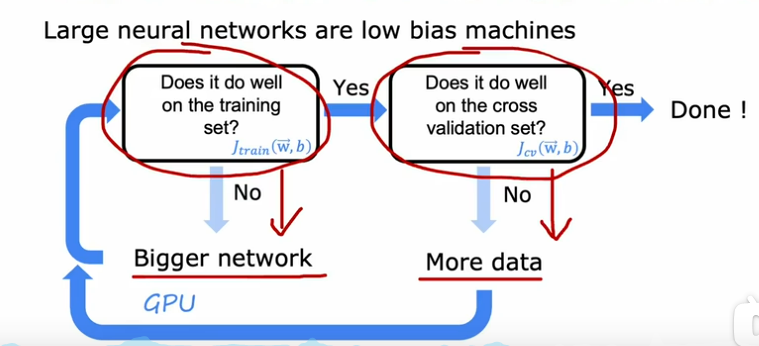
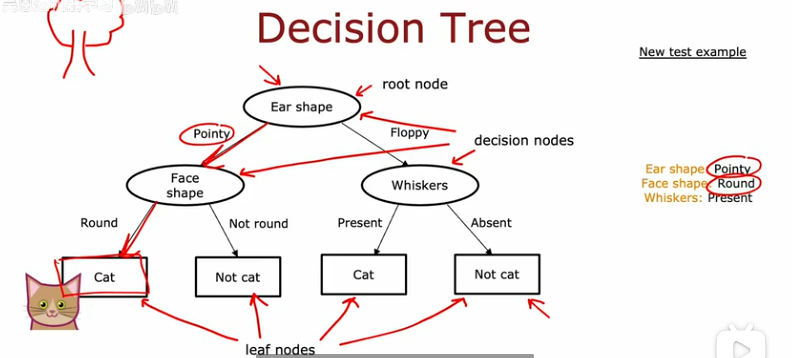
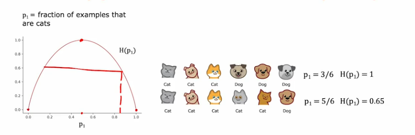

## 7.30进度

### 神经网络学习

1. 最开始是为了模仿人类大脑进行工作
2. 后来发现普通的机器学习模型随着数据量提升，性能也不会有过高的增加，意味着上限较低，利用神经网络能够随着数据的增加提高性能
3. $neuron$神经元：可以理解为大脑神经网络中一个最简化的模型，将线性回归或者逻辑回归的输出当作$a$，意为activation_values，对于一件衬衫，它本身的特征可能有$Price\ Shipping cost\ Marketing \ material$，这些属性决定衬衫的一系列品质，而一个消费者可能会在意衬衫的$Affordability\ awareness \ quality$，正常情况下可能会直接将衬衫的特征作为自变量而进行预测衬衫被购买的可能性，现在可以将价格和购物消费作为购买力的输入，市场作为知名度的输入，材质和价格作为质量的输入，这样就有三个神经元位于消费者特征前，再将这三个特征作为输入得到最后的预测概率，这样一来，消费者前面的三个神经元就被称为一个$Layer$，其中的购买力、知名度、质量就称为$Hidden\ Layer$也叫，最后的一层称为$Input\ Layer$输出层，隐藏层的意义就是在数据集中你并没有购买力等这些值，只有输入的x和输出的y
   
4. 当一个神经网络拥有很多层的时候，逐个神经元进行特征选择是非常耗时间的，所以在实际工作中通常会让所有神经元接受前一层的输入，然后通过设置参数来决定使用什么特征，这就是隐藏层的真正作用，这也叫做多层感知器
   1. 对于一个包含一层隐藏层的神经网络，输入是$\overrightarrow x$，隐藏层的每个神经元都包含一个$w_i^j,b_i^j$代表当前第j层隐藏层的第i个神经元对应的参数，每个神经元进行逻辑回归的拟合$g(z)=\frac{1}{1+e^z},z=w_i^j\overrightarrow x+b_i^j$之后，得到一个输出向量$\overrightarrow a^1$，这就是第一层的输出值，随后作为第二层也就是$Input\ Layer$的输入，继续进行同样的操作得到输出结果$a^2$
   2. 说明一个n层的神经网络时，通常指的是他有n-1层的隐藏层和一层输出层，而激活函数一般就是指$Sigmoid$函数
   3. 在一个真正的神经网络中，将输入值作为$\overrightarrow a^0$输入，从而得到$\overrightarrow a^1$一直到结果的过程叫做前向传播，是一个激活的过程
5. Python中数据的表示
   1. numpy中数据

      ~~~python
      np.array([100,200,300])"表示的是一维数组"
      np.array([[200]])"这是一个二维数组，只有一个值"
      np.array([200],[400])"这是一个2x1的矩阵"
      np.array([200,400][100,300])"这是一个2x2的矩阵"
      a1 = Dense(units = 25, activation = "sigmoid")
      print(a1)"将会输出tf.Tensor()"
      a1.numpy()"可以将其从tensorflow的向量数据形式转化为numpy的矩阵表达"
      ~~~

## 7.31进度

### 机器学习

1. 构建一个神经网络

   ~~~python
   import tensorflow as tf
   import numpy as np
   x = np.array([
       [220, 17],
       [250, 21],
       [120, 12],
       [212, 18]
   ])
   y = np.array([1, 0, 0, 1])
   layer_1 = tf.keras.layers.Dense(units = 3, activation = 'sigmoid',input_shape = (2,))
   layer_2 = tf.keras.layers.Dense(units = 1, activation = 'sigmoid')
   model = tf.keras.Sequential([layer_1, layer_2])
   model.compile(optimizer = 'adam', loss = 'binary_crossentropy', metrics = ['accuracy'])
   model.fit(x, y, epochs = 1000, verbose = 1)
   predictions = model.predict(x)
   for i in range(len(predictions)):
       print(f'Input: {x[i]}, Predicted: {predictions[i][0]:.4f}, Actual: {y[i]}')
   ~~~

## 8.1进度

### 机器学习

1. 使用高效的机器学习库例如tensorflow或者Pytorch，但是也应当理解代码的背后原理

   1. 对于一个2层的神经网络，通过编写函数可以避免逐个神经元代码编写

      ~~~python
      import tensorflow as tf
      import numpy as np
      def dense(a_in, W, b):
          units = W.shape[1]
          a_out = np.zeros(units)
          for j in range(units):
              w = W[:,j]
              z = np.dot(w, a_in) + b[j]
              a_out[j] = sigmoid(z)
          return a_out
      W = np.array([
          [1, -3, 4],
          [2, 5, 7]
      ])
      b = np.array([1, 2, 3])
      x = np.array([-2, 4])
      def Sequential(x):
          a1 = dense(x, W1, b_1)
          a2 = dense(x, W2, b_2)
          f_x = a_2
          return f_x
      ~~~
   2. 更加高效的执行方式？matmul是指$matrix\ multiplication$，并且传入的矩阵必须严格按照有效顺序，不然会无法计算，保持前一个矩阵的列数是后一个矩阵的行数，python内置的矩阵乘法运算符是@

      ~~~python
      def dense(a_in, W, B):
          Z = np.matmul(a_in, W) + B
          f_x = Sgimoid(Z)
      W = np.array([
          [-1, 3, 4],
          [2, -5, 6]
      ])
      B = np.array([[2, 1, 3]])
      a_in = np.array([[-1, 4]])
      ~~~
2. 使用tensorflow进行模型的训练

   ~~~python
   from tensorflow.keras.layers import Dense
   from tensorflow.keras.losses import BinaryCrossentropy
   from tensorflow.keras import Sequential 
   x = np.array([
     [200, 12],
     [250, 27],
     [120, 10]
   ])
   y = np.array([1, 0, 0])
   model = Sequential([
     Dense(units=3, activation='sigmoid', input_shape=(2,)),
     Dense(units=1, activation='sigmoid')
   ])
   model.compile(loss=BinartCrossentropy())
   model.fit(x, y, epochs=100)
   ~~~
3. 训练流程与普通回归模型也一致，首先定义函数本身，随后确定好需要使用的损失函数，最后开始梯度下降
4. 针对分类任务，损失函数$BinaryCrossentropy$，也叫做二元交叉熵，表达式就算是逻辑回归中的损失函数$L（f(x),y）=-ylog(f(x))-(1-y)log(1-f(x))$的函数，针对回归任务，可以使用最小化平方误差，名为$MeanSquareError$

## 8.2进度

### 机器学习

1. 激活函数的替代：$Relu$，$\{^{z<0,Relu(z)=0}_{z>0,Relu(z)=z}$，这就是Relu的表达式，以及线性激活函数也就是不改变值
2. 激活函数的选择：
   1. 面对二分类问题，最好选择$Sigmoid$函数
   2. 面对变化值的预测，因为有正有负，最好选择线性激活函数
   3. 面对某些非负的数值，选择$Relu$
   4. 相比sigmoid，relu不仅计算更加快速，并且也能加快梯度下降的速度，而sigmoid在两端都是平缓的，所以现在大部分神经网络的隐藏层都采用relu激活函数
3. 多类问题：目标不再是两个分类结果，而是三个四个以上的，通过$Softmax$而不是$Sigmoid$能够解决输出多个分类概率的问题
   1. $Softmax$：计算方法，对于每个类别的不同分类计算结果，$Sigmoid()=\frac{e^{z_i}}{\sum _{i=1}^{N}e^{z_i}}$，这样就做到了概率和为1

## 8.3进度

### 机器学习

1. 多类别分类问题：

   1. 应用softmax和其他激活函数不同，softmax使用了上一层所有的输出，而其他激活函数例如$Sigmoid,Relu$仅仅使用了当前输出值对应的上一层某个输出，例如$a_1$来自于$z_1$等等
   2. 使用softmax在代码中应当修改为

      ~~~python
      Dense(units=10, activation='softmax')
      ~~~
   3. 同时对应编译的损失函数也需要改为稀疏类别交叉熵损失函数

      ~~~python
      model.compile(SparseCategoricalCrossentropy())
      ~~~
   4. 在计算机中$x=\frac{2}{10000}$与$x=\frac{1}{10000}+\frac{1}{10000}$结果并不相同，通过输出小数点后18位能发现，分开的和结果为0.199999978，所以直接使用之前的代码段容易提升误差，为了减小误差，改变以往$a=g(z)=\frac{1}{1+e^{-z}},L=-ylog(a)-(1-y)log(1-a)$直接使用$L=-ylog(\frac{1}{1+e^{-z}})-(1-y)log(1-\frac{1}{1+e^{-z}})$能够提高精度，减小误差

      ~~~python
      model.compile(loss=BinaryCrossentropy(from_logits=True))
      ~~~

      对比softmax的神经网络，如果把$a_i=g(z_i),L=-log(a_i)$计算出来，误差会提升，因为log函数，会将数据之间的差异性放大，log函数在不同的x区间上变化幅度不一致，所以在传入最后概率的计算时，直接将z值传入到损失函数而不是先计算一层，如$L=-log(\frac{e^{z_1}}{e^{z_1}+e^{z_2}+e^{z_3}})$，代码需要做以下修改

      ~~~python
      model=Sequential([
          Dense(units=25, activation='relu'),
          Dense(units=10, activation='linear')
      ])
      model.compile(loss=SparseCategoricalCrossentropy(from_logits=True))
      logits = model(X)
      f_x = tf.nn.softmax(logits)
      ~~~
2. 多标签分类问题：对于一张马路图片，里面可能包括行人，公交，汽车，这个时候每个图片对应的数据就不是单一的一个结果了，对于数字识别0-9，每个图片仅仅有可能是其中的一个数字，但是对于一张马路照片，可能同时包含汽车，行人，马路，这个时候的结果$y=[1, 0, 1]$就是一个向量而非单一的0和1
3. 更快速的梯度下降方法：$Adam$，自适应动量估计，通过观察损失函数下降的速度和步伐动态调整学习率，并且每个参数的学习率都不一样，当下降缓慢时，且变化不大，增大学习率，下降振荡明显，缩小学习率

   ~~~python
   model.compile(optimizer=tf.keras.optimizers.Adam(learning_rate=1e-3),loss=tf.keras.losses.SparseCategoricalCrossentropy())
   ~~~
4. 卷积层$Convolutional\ layer$是神经网络中一个经常使用的隐藏层，是指通过限制模型观察到的数据，例如对于一张图片，只观察一部分区域而不是整张图片作为第一个神经元的输入，第二个神经元类似，始终保持获得数据的一部分，这样做的好处是能够有效加快计算时间，同时也能避免过拟合，降低了数据的需求量。同时后面隐藏层也不会接受前一层所有的输出，而是选择一部分作为输入，这样的计算甚至可能会比之前的密集层更加高效
5. 训练完毕后模型评估：

   1. $min(Loss)$，看是否能够达到损失函数最小
   2. $training\ data\ error$，训练集上的损失
   3. $test\ data\ error$，测试集上的损失
   4. 对于二分类问题，可以利用标签正确的比例进行判断
6. 如何选择一个更适合自己算法的模型？比如如何选择多项式的最高阶数

   1. 首先数据集划分不再是8：2的训练集：测试集，而是6：2：2的训练集：交叉验证集$Cross\ validation(dev \ set)$：测试集
   2. 根据自己需求的区间，将区间内每个类型的参数均通过训练集进行训练，随后计算每个模型在交叉验证集上的损失大小，选择最小的那个，如果需要了解模型的泛化能力，就使用测试集$test\ data$进行损失的计算来代表最终的泛化效果。
7. 诊断偏差$high\ bias$或者方差$high\ variance$

   1. 计算$J_{train}$和$J_{test}$，如果都高，说明是高偏差，参数本身就不拟合，如果$J_{train}$比较低，但是$J_{test}$比较高，说明高方差，模型过拟合，如果都低，说明模型比较合适了
   2. 如何利用正则化来进行方差和偏差的优化，正则化系数$\lambda$很小时，对于w的影响几乎不存在，所以当$J_{train}$比较小，对应的$J_{test}$可能会过大，当$\lambda$很大时，模型几乎会把参数设置为0，那么不管是$J_{train}$还是$J_{test}$都会很大，绘制出来的图像就和横轴为$degree\ of\ polynomial$的图像保持对称
8. 表现基准

   1. 并不能完全要求一个模型表现的非常好，如果是人类都无法很好的完成的情况下，通过与人类水平比较，其他模型比较，以及基准实验来衡量模型效果，并不能简单的通过损失判断模型优劣
   2. 通过学习曲线也能比较直观的表现出模型的效果如何
      1. 对于一个正常表现的模型，随着数据集的增大，模型的$J_{train}$会从小逐渐增大，随后保持一个比较平缓的增长速度，$J_{test}$会从比较大逐渐下降到一个区域然后保持一个平缓的下降速度。
      2. 对于$High\ bias$的模型，也是类似的表现，但是损失渐近线会更高，同时损失达到这个线的速度也会极快，也就是模型已经完全失效了，数据再多也没用了
      3. 对于$High\ variance$的模型，也许$J_{train}$会比基准表现还要低，同时与$J_{test}$之间还会存在很远的距离，而基准表现就在两者之间，但是随着数据的增加，最后两者会回到一个正常表现的模型
9. 应用后评估，如何进行模型的调整？发现应用到实际当中的模型出现了高方差或者高偏差的问题，如何进行改进？

   1. 增加更多的数据集->可以改进$High\ variance$
   2. 使用特征的子集->可以改进$High\ variance$
   3. 使用更多的特征->可以改进$High\ bias$
   4. 特征工程->可以改进$High\ bias$
   5. 增大$\lambda$->可以改进$High\ variance$
   6. 减小$\lambda$->可以改进$High\ bias$】
10. 日常生活中遇到高方差或者高偏差问题该怎么办？

    
11. 正则化对于模型几乎没有坏处，一个大的神经网络模型通过正则化训练能够达到小网络的效果，代码中添加正则化只需要添加参数`kernel_regularizer=0.01`

## 8.4进度

### 机器学习

1. 如何建立一个神经网络系统？选择合适的模型、数据->进行训练->根据方差偏差和错误进行分析->进行参数的调整等等措施->重新回到第一步再次训练
2. 如何进行错误分析？假设模型在某些样本上表现不好，可以取出一部分分类错误样本，观察这些样本之间存在什么联系，或者都有什么共同表现，以垃圾邮件为例，这些邮件是不是都有故意拼错单词？或者都有共同的单词，或者都是关于共同领域的。总体上就是通过手动检查错误例子，进而决定模型需要在什么方面改进
3. 数据增强$Data\ Augmentation$，利用现有的例子去创建新的数据，例如音频识别中，通过添加噪声或者增加失真，来创建一个新的音频数据，在图像识别中，通过截取一部分原图或者通过手动编码创建类似的图像作为新数据
4. 迁移学习$Transfer \ learning$，通过在其他应用上训练过的模型，更改模型输出层神经元数量从而进行所需数据的训练，
   1. 例如现在需要训练识别0-9，但是有个数据集是关于猫狗以及动物类的，类别有1000种，那么就先在这个数据集上训练好参数，随后将最后一层神经元数量改为10，然后最后一层参数初始化，利用现在的数字识别数据集进行训练
   2. 有两种训练方式，第一种是不改变前面隐藏层的参数，直接固定，只让损失函数对最后一层输出层参数进行迭代。第二种是前面隐藏层参数也正常进行迭代，以此进行迁移学习。
   3. 上述做法的第一步就叫做有监督预训练$Supervised\ pretraining$，第二步就叫做微调$Fine\ tuning$，为什么这样能够起到效果？因为第一步的预训练模型在第一层可能是发现图像边缘，下一层是连接线条，这些特征的学习对于识别人物都有效果，所以不管是猫狗还是数字都可以起到比较好的作用
   4. 这样的训练过程必须保证输入的数据都是同类型的，不能将音频识别的模型用于图像领域的微调
5. 一个完整的机器学习项目周期包括什么？
   1. 确定项目范围，具体的是模型用来做什么任务？
   2. 搜集需要使用的数据集或者自己进行数据集建立
   3. 训练模型，并不断优化或者添加数据，包括$bias,variance,error$的分析，直到模型效果达到自己的要求
   4. 部署到实际的系统当中，当性能下降时对其进行调整，或者发现模型缺失某些学习特征时，重新进行训练
6. 数据倾斜的数据集如何进行结果评价？
   1. 准确率：被预测正确的正例占所有预测为正的正例的多少？一个人被预测为有病，那他真正患病的概率
   2. 召回率：被预测正确的正例占实际上真正是正例的多少？一个人真正有病，他被检测出来的概率
   3. 在预测中，阈值一般被设置为0.5，实际上一般疾病的预测，高于一个大于0.5的数字才会被确定为正，所以这个时候精确率$Precision$提高了，因为判断为正的例子更有可能是患病的，但是召回率$Recall$降低了，因为原本被预测为正的例子现在可能不会被预测了，导致召回率的分子降低
   4. F1分数：为了避免准确率和召回率相差过大的影响，不使用二者的平均而是通过F1分数来计算，f1分数更强调结果偏向于小的那个值，而不是受到大的值影响$F1=2\frac{1}{\frac{1}{R}+\frac{1}{R}},F1=2\frac{PR}{P+R}(调和平均harmonic)$
7. 决策树：通过数据结构中的树，为每个路径都设置条件，代表如何继续往下走，叶子节点是结果，途中的内部节点代表每个特征，每个内部节点的子树代表不同的特征路径
   

## 8.5进度

> 机器学习第二部分完结，准备进入高级算法

### 机器学习

1. 决策树
   1. 内部节点要尽量能够让左右子树分类清晰，例如左侧一定全是符合某个特征，右侧一定不符合，最大化纯度
   2. 停止的时机
      1. 当一个节点全部都满足要求时不再细分
      2. 当继续拆分时导致树会超出最大深度
      3. 当拆分节点带来的纯度增长没有达到预期时也不再拆分
      4. 当某个节点的数量小于阈值时也不再拆分
   3. 熵$entropy$：衡量节点内部纯度的函数，$H(p_1)=-p_1log_2(p_1)-(1-p_1)log_2(1-p_1)$，与逻辑损失函数类似
      
   4. 信息增益$information\ gain$：熵的减少，先计算出子结点的熵，再通过加权平均计算出分支的代表熵，计算公式$H=(the \ number\ of\ left\ node)H(p_{left})+(the\ number\ of\ right\ node)H(p_{right})$，将父节点的熵值减去加权平均后的子结点熵，就是最后的比较结果，选择最大熵的减少程度
   5. 独热编码$one-hot\ encoding$，如果一个特征可以取得两个以上的离散特征值，为将其所有的可能性各自拆分为一个特征，原本有K个取值的特征现在变成了K个不同的特征
   6. 对于连续的特征值独热编码无法起效，但是可以通过设置阈值，来区分左右，阈值的选择也需要考虑信息增益的大小，根据能够带来最大增益的阈值进行分别，例如10个动物以体重划分，若以8kg为阈值，左子树分到两个猫，右侧有三个猫和五个狗，此时的信息增益就是$F=H(\frac{5}{10})-(\frac{2}{10}H(\frac{2}{2})+\frac{8}{10}H(\frac{3}{8}))$，不停的以不同的阈值进行计算，最后选择结果最大的
2. 回归树
   1. 回归树和线性回归模型类似，都是预测一个值，而不是二分类，并且每个内部节点的特征选择也不同于决策树，回归树要求子结点拥有最小的结果方差
   2. 首先计算子结点的方差$v_{left},v_{right}$，随后计算每个子结点占父节点的份额$w_i$，同样计算父节点方差$v_i^p$，计算方差缩小值为$w_i^p-(w_{left}v_{left}+w_{right}v_{right})$，选择最大缩小值的分类结果
   3. 每个叶节点预测结果是其均值
3. 多决策树，利用多个决策树进行结果的预测，因为单一的决策树很容易受到样本的影响，所以利用多个决策树同时预测，最后选择投票多的
   1. 多决策树需要利用到有放回抽样，以此来构建一个不同于初始训练集的新训练集
   2. 随即森林算法：利用有放回抽样构建新的数据集，然后利用每个创建的数据集进行一次树的训练，这样随着树的增加，最后就会得到庞大的树，但是这样执行的结果可能会导致许多树并没有较大的差异，也许根节点甚至没有改变，所以在每次训练新的决策树前，会决定模型从哪些特征中选择作为内部节点，比如特征总数为100，模型可能会约束在50个特征内选择，一般使用总特征数量的平方根
   3. 随机森林算法能起效是因为替换样本数据本身就引起了数据变换，限定可选择的特征数量能够引起更大的变化
   4. $XGBoost$：提升决策树方法，和随机森林第一步一致，在完成第一个样本替换并且训练后，此刻第二个新数据集产生与第一个不同，第二次进行样本替换时更偏向于选择那些在第一轮训练中表现不好的样本，而不是等可能的选择每一个样本进行替换

      ~~~python
      from xgboost import XGBClassifier
      from xgboost import XGBRegressor
      model = XGBClassifier()
      model.fit(x, y)
      f = mode.predict(x)
      ~~~
4. 什么时候使用决策树？数据是结构化特征明显的，类似于表格一样的数据，文本图像等数据并不适合使用决策树，决策树优点在于训练快速。而神经网络适合任意类型的数据，包括结构化、半结构化和非结构化的，并且神经网络可以使用迁移学习，同时更方便多个网络共同使用，但缺点就是比较慢
