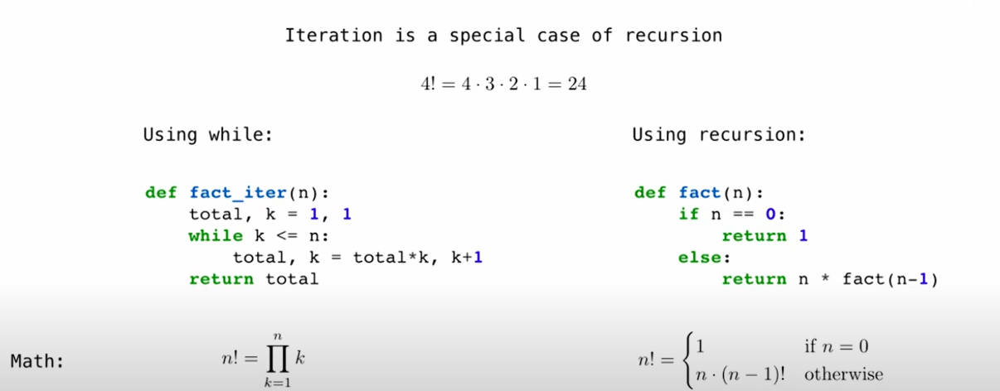
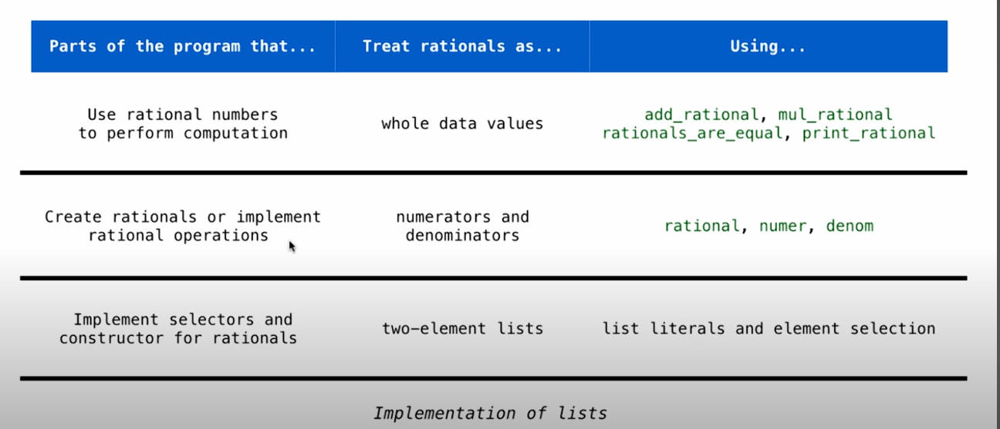

# python学习笔记

## 6.20进度

**命名，赋值，用户定义的函数：**

1. 通过导入包来使用常见表达式或命名：例如PI等数学量，add或square等数学表达式。
2. 自定义名称并通过赋值符号"="为其赋值
3. 通过`def`定义function

   ```apache
   def function(param1 , param2):
       this is a expression
       return result
   ```

**环境框架作用：**

1. 维护所有自定义名称：其值或关联的函数
2. 进行表达式的运算

   > 赋值语句中的所有表达式执行完毕后才进行赋值，下式结果b最终为3，a最终为2
   >

   ```apache
   a = 1
   b = 2
   b , a = a+b , b
   ```

**定义函数(`def`)：**

~~~apache
def Function(param1 = 20 , param2 = 3):
    return max(sqrt(param1),sqrt(param2))
~~~

## 6.21进度

**打印与None**

1. None没有含义，代表空
2. 一切未定义具体返回值的函数均返回None
   ~~~apache
   print(print(1), print(2))//将会输出1,2,none,none
   ~~~

**多环境下的统一框架**

1. 通过标签进行不同函数的区分

   ~~~apache
   Global Frame
   {  square:function
      mul:function
   }
   f1:square(parent:Global)
   {  x:3
      return 9
   }
   ~~~
2. 执行某个函数时，以此函数为最新环境，寻找函数所需的参数与表达式说明，逐级向上寻找

   执行square时，获取参数3，但未找到mul函数，于是向父级框架中寻找，确认了mul的操作

*使用vim进行多行python代码编写(vim待学习)*

## 6.22进度

### linux学习

**vmware虚拟机安装：**

1. 下载ubuntu镜像文件，并使用vmware workstation导入镜像文件
2. 选择对应选项进行安装

安装问题：

1. 使用apt无法安装code，使用snap才可以安装

   ~~~apache
   $ sudo snap install --classic code
   $ code//启动vscode
   ~~~
2. 更新下载源

   ~~~apache
   $ sudo apt update
   ~~~

**问题清单**：

1. ssh连接问题：使用ssh连接报错connection refused，问题待解决
2. 下载方式中的apt，snap等等有什么区别
3. vim常用操作待学习

### cs61课程学习：

**python各种特性**

1. 命令行运行python，使用参数`-i`可以进行交互式执行

   ~~~apache
   $ python -i example.py
   ~~~
2. 使用注释"""进行函数说明与用例展示

   ~~~apache
   def absolute_value(x):
     """Return the absolute value of x."""
     return abs(x)
   ~~~

**条件语句**

1. 普通条件控制

   ```a
   if  condition:
     statement
   elif condition:
     statement
   else:
     statement
   ```
2. 传入的x为负数，下列语句也无法执行，python会对每个参数进行评估，若不能评估通过就会执行失败
   X<0时，评估sqrt（x）会失效，所以执行失败

   ~~~apache
   def real_sqrt(x, sqrt(x), 0.0):
     if x > 0:
       return sqrt(x)
     else return 0.0
   ~~~
3. **"短路行为"**，添加and或者or的组合条件判断语句

**高阶函数**（分离出不同函数间的共同点，提高公共部分利用率）：

1. 寻找出不同形状的图形面积计算公式共同点，从而简化函数

   > assert condition, "statement"//通过condition的结果从而决定是否打印后边的句子，assert称为断言
   >

   ~~~apache
   $ assert 2 > 3, 'Math is beautiful.'
   $ assert 3 > 2, 'Math is huge.'
   ~~~
2. 以正方形、圆形、正六边形为例：

   ~~~apache
   """单独计算,其中判断边长正负需要在每个函数中添加"""
   def area_square(r):
     return r * r
   def area_circle(r):
     return r * r * PI
   def area_hexagon(r):
     return r * r * sqrt(3) * 3 / 2
   """提取共同点，并统一判断"""
   def area_shape(r , shape_constant):
     assert r > 0, 'edge must be postive!'
     return r * r * shape_constant
   ~~~
3. 隐形参数的传入

   ~~~apache
   def make_adder(n):
     def adder(x):
       return x + n
     return adder
   """通过调用make_adder(3)(2)可以将2传给adder(x)的x作为实参"""
   $ f = make_adder(3)
   $ f(2)
   """上述也可以执行"""
   ~~~

## 6.23日进度

### CS61课程学习

**嵌套环境**

> Nested 嵌套的 intrinsic 固有的 recursion 递归

1. 嵌套环境下函数的执行

   ~~~apache
   def make_adder(n):
     def adder(x):
       return x + n
     return adder
   $ add_three = make_adder(3)
   $ add_three(4)//it will print "7"
   ~~~

   执行过程中，make_adder为Global frame，add_three为f1 frame，继承于Global frame，此时add_three相当于如下函数：

   ~~~apache
   def add_three(x)
     return x + 3
   ~~~

**本地域与复合函数**

1. 不同函数域内无法互相访问，除非函数是嵌套定义，内层可以访问外层

   ~~~python
   def make_adder(x):
     def adder(n):
       return x + n
     return adder
   def square(x):
     return x * x
   def compose(f , g):
     def h(x):
       return f(g(x))
     return h
   $ f = compose(square, make_adder(3))
   $ f(5)//print "64"
   ~~~

**lambda函数**

1. 小型、内联的函数，能够在不定义完整函数体的情况下当做函数使用

   > 与def的区别仅仅在于一个有正式的名字，另一个靠赋值lambda  argument : expression
   >

   ~~~apache
   lambda  argument : expression
   $ f = lamdba x : x * x
   $ print(f(5))//25
   ~~~

**Curry化**：将一个接受多参数的函数转化为一个接受单参数的高阶函数，这个函数返回一个包含剩余参数的函数

**递归**

1. 返回函数本身，从而能够传入多个参数

   ~~~python
   def print_all(x):
     print(x)
     return print_all
   $ print_all(1)(3)(5)//1 3 5 
   ~~~
2. 返回函数内部定义的函数

   ~~~python
   def print_all(x):
     print(x)
     def sum(y):
       return print_all(x + y)
     return sum
   $ print_all(1)(3)(5)
   ~~~
3. 返回函数以及参数从而进行递归

   ~~~python
   def spilt(n):
     return n / 10 , n % 10
   def sum_logits(n):
     if n < 10:
       return n
     else:
       all_but_last,last =  spilt(n)
       return sum_logits(all_but_last+last)
   ~~~
4. 迭代与递归的差距在于，同一个问题的解决办法，例如阶乘，通过迭代写出代码而得到的数学计算公式与通过递归写出代码得到的数学计算公式不同

   
5. 判断写的递归条件是否正确：

   1. 检查最基础的情况
   2. 把整个函数进行抽象
   3. 假定最开始执行的递归是正确的
   4. 检查下一层递归是否正确

**luhn算法(银行卡号有效性检测算法)**

1. 从最右侧开始，从右往左，每个数字变为二倍，如果大于9，就把个位和十位加起来，变换完成后求和
2. 将和模10，再用10去减这个数字得到校验位

   ~~~python
   def luhn(n, sum=0, odd=True, c=True):
       length = len(str(n))
       if length % 2 == 0 and c:
           odd = not odd
       if odd:
           f1sum, n = n % 10, n // 10
       else:
           f1sum, n = n % 10 * 2, n // 10
       print(n, f1sum, sum, odd)
       if f1sum > 9:
           f1sum = f1sum % 10 + f1sum // 10
       if n > 0:
           return luhn(n, sum + f1sum, not odd, False)
       else:
           return sum + f1sum
   ~~~

## 6.24进度

### CS61课程

**递归调用的顺序**

1. 不停递归直到最内层递归执行完毕

   ~~~python
   def cascade(n):
     if n > 9:
       print(n)
     else :
       print(n)
       cascade(n // 10)
       print(n)
   //内联函数，下式代码为该函数生成图形的y轴对称图形函数
   def grow(n):
       if n < 10:
           print(n)
       else:
           grow(n // 10)
           print(n)
   def decline(n):
       if n > 10:
           print(n)
           decline(n // 10)
       else:
           print(n)
   def reverse_cascade(n):
       grow(n)
       decline(n)
   ~~~
2. Tree recursion

   `fabonacci`数列在计算第n个数时，采用树形递归，分别计算`fabonacci(n-1)`和`fabonacci(n-2)`

   以类背包问题为例：（n, k）其中n代表数字之和，k代表求和数字中最大可以使用多少，计算出当和为n且最大数字为k时的种类情况。

   ~~~python
   def count_partitions(n, k):
       if n < 0:
           return 0
       elif k == 0:
           return 0
       elif n == 0:
           return 1
       else:
           return count_partitions(n - k, k) + count_partitions(n, k - 1)
   ~~~

## 6.25日进度

### CS61课程学习

**列表和容器**

1. List：列表，无处不在

   ~~~python
   l1 = [1, 2, 3, 4]
   l2 = [2//2, 3+3, 4*2]
   print(l1 + l2 * 2)//[1, 2, 3, 4, 1, 6, 8, 1, 6, 8]
   getitem(l1, 1)//2
   ~~~
2. 列表内置运算符：in，只能检测单个元素，不能检测子序列是否存在

   ~~~apache
   print(5 in l1)//False
   print([1, 2] in l1)//False
   print([1, 2] in [1, [1, 2], 5])//True
   ~~~
3. 列表迭代：for，无需添加索引

   ~~~python
   total = 0
   for element in l1 :
     if element == 1:
       total += 1
   for x, y in [[1, 2], [1, 3], [2, 2]]:
     if x == y :
       total += 1 
   ~~~
4. range: range[first, end]，一个递增的连续序列

   ~~~python
   """range与列表的转换"""
   m = range(-2, 2)
   print(list(m))
   """range作为迭代次数的工具"""
   for _ in range(3):
     print("Cheers")
   //下划线指代那些不需要考虑意义的数据，range(n)代表有三个元素
   ~~~
5. 在列表上构建列表

   ~~~python
   [x for x in [1, 2, 3, 4, 5] if x % 2 == 0]
   ~~~
6. 对列表进行切片

   ~~~python
   m = [1, 2, 65, 4, 6, 7]
   print(m[1:-2])//[2, 65, 4]

   //获取一个列表中和为n的子序列
   def large(s, n):
       if s == []:
           return []
       elif s[0] > n:
           return large(s[1:], n)
       else:
           first = s[0]
           with_s0 = large(s[1:], n - first) + [first]
           without_s0 = large(s[1:], n)
           if sum_list(with_s0) > sum_list(without_s0):
               return with_s0
           else:
               return without_s0
   ~~~
7. 常用的容器函数

   ~~~python
   //sum(iterable[, start])
   $ sum([1, 2, 3])
   $ sum([1, 2, 3], [4])

   //max(iterable[, func])
   $ max(range(5))
   $ max(range(5),lambda x:x-1+65)

   //all(iterable) -> bool
   all([x < 5 for x in [1, 2, 3, 4]])
   ~~~
8. 字符串：字符串中的in可以检测连续字符是否出现，但在列表中in就无法检测是否有连续的数字序列
9. 字典dictionaries:

   ~~~apache
   numeral = {'V':5, 'I':2, 'P':1}
   d = {1:'vip'}
   //键不能重复，也不能是字典或者列表
   $ numeral.values()
   $ return {key: [value for value in range(30,50) if value % key ==0] for key in [7, 9, 11] }
   ~~~

**数据抽象**

1. 抽象层级：
   
2. 编写代码提高数据抽象性，改动某一函数时尽量不引起其他函数变化

   ~~~python
   def rational(n, d):
       return [n, d]
   def numer(x):
       return x[0]
   def denom(x):
       return x[1]
   """截然不同的有理化和取分子分母方式"""
   def numer(x):
       return x("n")
   def denom(x):
       return x("d")
   def rational(n, d):
       def select(x):
           if x == "n":
               return n
           else:
               return d

       return select

   def yuefen(x):
       nx = numer(x)
       dx = denom(x)
       while dx != 0:
           nx, dx = dx, nx % dx
       return [numer(x) // nx, denom(x) // nx]
   def add_rational(x, y):
       return yuefen([numer(x) * denom(y) + numer(y) * denom(x), denom(x) * denom(y)])
   def mul_rational(x, y):
       return yuefen([numer(x) * numer(y), denom(x) * denom(y)])
   def div_rational(x, y):
       return yuefen([numer(x) * denom(y), denom(x) * numer(y)])
   ~~~

**树**

1. 树的抽象数据操作：

   ~~~python
   def istree(tree):
       if type(tree) != list or len(tree) < 1:
           return False
       for branch in branches(tree):
           if not istree(branch):
               return False
       return True

   def tree(label, branches=[]):
       for branch in branches:
           assert istree(branch)
       return [label] + branches

   def label(tree):
       return tree[0]

   def branches(tree):
       return tree[1:]
   ~~~
2. 斐波那契树：

   ~~~python
   def fib_tree(n):
       if n == 0 or n == 1:
           return tree(n)
       else:
           left, right = fib_tree(n - 1), fib_tree(n - 2)
           return tree(label(left) + label(right), [left, right])
   ~~~
3. 统计树叶个数：

   ~~~python
   def count_leaves(tree):
       if branches(tree) == []:
           return 1
       else:
           sum = 0
           for branch in branches(tree):
               sum += count_leaves(branch)
           return sum
   ~~~
4. 树的叶子遍历：

   ~~~python
   def print_tree(tree):
     if branches(tree) == []:
       print(label(tree))

     else :
       for branch in branches(tree):
         print_tree(branch)
   ~~~
5. 叶子结点的父节点之和与节点之和为N的路径数量

   ~~~python
   t = tree(3, [tree(-1), tree(1, [tree(2, [tree(1)]), tree(3)]), tree(1, [tree(-1)])])

   def parent_leaves(tree, sum=0):
       if branches(tree) == []:
           print("节点", label(tree), "父节点和:", sum)
           return sum
       else:
           current = 0
           for branch in branches(tree):
               current += parent_leaves(branch, sum + label(tree))
           return current
   def sum_leaves(tree, sum=0, order=0):
       current = 0
       "代表当前路径总和"
       sum += label(tree)
       "一致则加1"
       if order == sum:
           current = 1
       for branch in branches(tree):
           current += sum_leaves(branch, sum, order)
       return current
   ~~~

## 6.26进度

### CS61A课程学习

**字符串**

1. 内置函数：upper、lower、swapcase

**突变操作**

1. 同一对象，及时利用了不同的名称进行操作，其他名称也会发生更改

   ~~~python
   four = ["ding", "ceshi"]
   two = four
   two.pop()
   print(four)//four同样发生变化
   ~~~
2. 使用`is`来判断两个名称是否是同一对象，使用equal来判断两个名词的值是否一致（有可能不是同一对象）

   ~~~python
   b = [10]
   a = b
   $ a is b
   //True
   a, b = [10]
   $ a is b
   //False
   $ a == b 
   //True
   ~~~
3. 列表中的变与不变

   ~~~python
   s, t = [1, 2], [5, 6]
   s.append(t)
   t[0] = 1
   $ s //[1, 2, [1, 6]]"append"是引用了t,t的更改会引起s的更改
   s.extend(t)
   t[0] = 1
   $ s //[1, 2, 3, 5]"extend"是复制了t，t的更改与s无关
   a = s + [t]
   b = a[1:]
   b[1][1] = 1
   $ t //[3, 1]"a依旧引用了t"
   ~~~

**元组**

1. 使用逗号分隔，小括号包围

   ~~~python
   (2, 3)
   (2,)
   ~~~
2. 元组的值不可变化，可以用作字典里面的键，但是列表可不行，同时元组也不能作为值

   ~~~python
   tupples = (1, 2, 3)
   tupples[0] = 2//TypeError
   tup = ([1, 2], 3)
   tup[0][0] = 2
   $ tup//([2, 2], 3)
   ~~~

**迭代器**

1. 使用iter做访问指针，使用next做前进函数，字典中使用dict.keys()/values()/items()作为迭代部分

   ~~~python
   t = [1, 2, 3, 4]
   it = iter(t)
   next(it)
   dict = ['one':1, 'two':2, 'three':3]
   it = iter(dict)//iter(dict.keys())
   "在迭代过程中更改字典的形状会导致迭代器失效"
   "使用for来进行迭代器的前进会导致迭代器本身也前进"
   for i in it:
     print(i)
   "执行完毕后，it会迭代到末尾，从而无法使用"
   ~~~
2. 内置迭代函数：延迟计算，需要值的那一刻才会计算

   ~~~python
   t1 = [1, 2, 3, 4]
   f = lambda x:x * x
   t = map(f, t1)"filter/zip/reverse/tuple/list/sorted返回的都是迭代器"
   "filter(function, iterable)满足function的才会返回"
   "zip(first_iter, second_iter)返回相同索引的[]"
   "reversed(sequence)"
   "map(func, iterable)为所有iterable执行func"
   for i in t:
     print(i)
   ~~~
3. 回文数

   ~~~python
   def palindrome(s):
       t = list(zip(s, reversed(s)))
       for i in t:
           if i[0] != i[1]:
               return False
       return True
   "zip返回相同索引的组合"
   ~~~

**生成器**

1. 使用yield做函数的返回而不是使用return，yield可以返回多次

   ~~~python
   def plums(x):
     yield(x)
     yield(-x)
   $ t = plums
   $ next(t)

   "yield from 相当于for循环中yield的简写"
   ~~~
2. 什么情况下需要使用生成器？当计算的结果非常庞大，而仅仅需要其中的一部分时，使用生成器就可以避免一次性全部计算，从而提高执行速度
3. 三个简易算法题：

   ~~~python

   def max_adjsum(s):
       sum = [s[i] + s[i + 1] for i in range(len(s) - 1)]
       for i in sum:
           max = i
           for j in sum[1:]:
               if j > max:
                   max = j
       print("最大相邻和:", max)


   def houzhui(s):
       t = []
       for i in s:
           if i % 10 not in t:
               t.append(i % 10)
       sorted_t = sorted(t)
       print(sorted_t)
       dict = {x: [] for x in sorted_t}
       for i in s:
           dict[i % 10].append(i)
       return dict


   def repeat_element(s):
       dict = {x: 0 for x in s}
       for i in s:
           dict[i] += 1
       for key, value in dict.items():
           if value <= 1:
               yield str(key) + "只出现了一次"
           else:
               yield str(key) + "出现了" + str(value) + "次"
   ~~~
4. 嵌套函数：搞清楚真正的执行顺序以及执行过程

   ~~~python
   def delay(arg):
       print("delayed")
       def g():
           return arg
       return g
   $ delay(delay)()(6)()

   def pirate(arggg):
     print("matey")
     def plunder(arggg):
        return arggg
     return plunder
   $ pirate(pirate(pirate))(5)(7)
   ~~~

## 6.27进度

### CS61A课程学习

**编写算法流程**

1. 阅读好描述，真正理解题目要求后再做回答（通过示例验证自己是否理解要求）
2. 如果有模板：
   1. 查看模板对自己是否有作用
   2. 如果有用，则对模板进行填充或更改
   3. 如果没用，就自己编写新的函数

类和属性

1. 管理抽象数据，并追踪数据状态，定义了数据的操作限制，list就是一个类，包含有append、extend、insert、pop、remove等等操作
2. 类的定义：

   ~~~python
   class account:
     def __init__(self, account_holder):
       self.holder = account_holder
       self.balance = 0
   ~~~
3. python可以随时为类添加新属性，其值甚至可以是类本身
4. 调用类的属性或者方法使用点表达式，二者均属于类方法

   ~~~python
   $ getattr(class_name, attribute)"查看属性值"
   $ hasattr(class_name, attribute)"查看属性是否存在"
   $ Account.deposit
   <class function>
   $ tom_account.deposit
   <class method>
   "Object + function = Bound method"
   ~~~
5. 属性的更改对实例和对象影响范围不同，若赋值对象是实例，只会影响该实例的值，其余同类不受改变，如果赋值对象是一个类，那么所有由该类创造的实例都会受到影响

   ~~~python
   class Account: 
     interest = 0.2
     def __init__(self, holder):
   ...
   $ Account.interest = 0.4"所有Account类的interest属性全部变成0.2（仅当interest没有单独赋值过）"
   $ tom_account = 0.4"只改变tom的账户中的interest"
   ~~~

**继承(inheritance)**

1. 子类继承自父类，能够访问父类的方法以及属性， 也可以重写
2. 通过base.attribute或者base.method()调用
3. 适合表明"is a"的关系，CheckAccount is a Account

**组合(composition)**

1. 一个类以另一个类作为自己的属性（学生有成绩，成绩是一个类，包括科目和分数属性）
2. 适合表明"has a"的关系，Student has a grade

## 6.28进度

### linux配置

**虚拟机的重新安装（9:50-10:10）**

1. 下载虚拟机平台vmware workstation Pro
2. 创建一个新的虚拟机，镜像选择已下载的ubuntu22.04LTS
3. 一直点击next完成安装

**输入法安装（10:30-13:40）**

1. 进入linux系统桌面后，点击左侧导航栏show apps
2. 选择setting，在左侧寻找system，点击region and language
3. 选择manage install language，在弹出的设置中选择install/remove language，找到Chinese(simplified)
4. 点击Apply system-wide
5. 随后返回setting，找到keyboard，在终端中输入如下命令

   ~~~bash
   sudo apt install ibus-pinyin
   ~~~
6. 点击keyboard中的+号，搜索Chinese(intelligent)，即可完成中文输入法安装

**vscode/wechat安装（16:00-16:20）**

1. 在官网下载对应的x86安装包，下在路径默认在用户名下的Downloads中
2. 使用终端进入文件夹`cd Downloads`
3. 使用dpkg安装deb文件:

   ~~~bash
   sudo dpkg -i code....
   sudo dpkg -i wechat....
   ~~~
4. 安装完成后使用code和wechat启动对应程序

**ssh服务安装**

1. 使用命令确认ssh服务是否开启，若未开启，安装ssh服务，安装完成后会自动启动服务

   ~~~bash
   sudo systemctl status ssh
   sudo apt install openssh-server
   sudo apt install openssh-client
   ~~~
2. ssh连接命令:

   ~~~bash
   ssh username@ip
   ~~~

**Snipaste截图工具和QQ音乐安装（Appimage类型文件安装）**

1. Appimage运行需要FUSE库

   ~~~bash
   sudo apt install libfuse2
   ~~~
2. 赋予对应的Appimage文件执行权限

   ~~~bash
   chmod -X Snipaste.Appimage
   chmod -X qqmusic.Appimage
   ~~~
3. 使用./文件名.Appimage启动文件

   ~~~bash
   ./qqmusic.Appimage --no-sandbox
   "no-sandbox常出现在腾讯软件，sandbox有安全性要求，"
   ./Snipaste.Appimage --no-sandbox
   ~~~

**终端管理工具Screen**

1. screen强大之处在于能够隔离每个终端screen，使得进程在不中断的情况下仍然能使用终端

   ~~~bash
   "许多程序执行后会阻塞终端，导致无法使用"
   sudo apt install screen
   screen -S screen_name"创建一个名为screen_name的终端分幕"
   screen -r screen_name"进入刚刚创建的终端,使用exit或者ctrl+a,ctrl+d退出分幕"
   screen -ls"列出所有分幕"
   screen -X -S session_name quit"删除某个未激活分幕"
   "如果在某个分幕，直接输入exit"
   ~~~

## 6.29进度

### CS61A课程学习

**继承与属性**

1. 下列代码执行后的结果为：

   ~~~python
   class A():
     z = -1
     def f(self, x):
       return B(x-1)
   class B(A):
     n = 4
     def __init__(self, y):
       if y:
         self.z = self.f(y)
       else:
         self.z = C(y+1)
   class C(B):
     def f(self, x):
       return x
   a = A()
   b = B(1)
   b.n = 5
   C(2).n
   a.z = b.z
   a.z = C.z
   ~~~

   a是一个A实例，b是一个B实例，b.z是一个B实例（B(0)），b.z.z是一个C实例C(1)，b.z.z.z是1

   搞清楚每个函数的执行过程，返回值是什么，继承了什么，重写了什么
2. 多重继承

   ~~~python
   class example(base class1, bash class2)：
   ~~~

**字符串表现**

1. str和repr均可用来表示字符串，str面向人类，repr面向python解释器，实际上是调用__str__和__repr__内置函数

   ~~~python
   from fractions import Fraction
   b = Fraction(1, 2)
   print(str(b))"输出1/2，str会将字符串转为人类常见的形式"
   print(repr(b))"输出Fraction(1, 2)，repr会转为python解释器的样子"
   print(eval(str(b)))"输出0.5"
   print(eval(repr(b)))"输出Fraction(1, 2)"
   ~~~
2. F-string插值字符串，比使用字符串+字符串更快更简介

   ~~~python
   "PI is a number which means:" + str(PI)
   "use f-string:"
   f'PI is a number which means:{PI}'
   "花括号内会看作是python表达式"
   ~~~
3. 多态函数（Polymorphic Function）

   即使是不同的类型参数传入，函数仍能正确执行代码，repr和str会先获取传入数据的类型，再调取相应的__str__或者__repr__函数，下面是Ratio类型的示例

   ~~~python
   class Ratio:
     def __init__(self, numer, denom):
       self.numer = numer
       self.denom = denom
     def __repr__(self):
       return f'Ration({0}, {1})'.format(self.numer, self.denom)
     def __str__(self):
       return f'{0}/{1}'.format(self.numer, self.denom)
   ~~~

**特殊方法名称**

1. 包含两个下划线的名词

   ~~~bash
   """
   __add__ 双参数，将右侧数字添加到左侧
   __bool__ 将某个对象转为True\False
   __float__ 将某个对象转化为浮点数
   __str__ __repr__
   """
   ~~~
2. 为类对象定义操作方法：

   ~~~python
   class Ratio:
     def __init__(self, numer, denom):
       self.numer = numer
       self.denom = denom
     def __add__(self, other):
       if other is Ration:
         n = self.numer * other.denom + self.denom * other.numer
         m = self.denom * other.denom
       elif isinstance(other, int):
         n = self.numer * other
         m = self.denom
     g = gcd(n, m)
     return Ratio(n//g, m//g)
   $ Ratio(1, 3) + Ratio(1, 6)"Ratio(1, 2)"
   $ Ratio(1, 3) + 1"Ratio(4, 3)"
   ~~~

**对象**

1. 属性的寻找顺序：实例->类->基类

   ~~~python
   class Worker:
     greeting = "Sir"
     def __init__(self):
       self.elf = Worker
     def work(self):
       return self.greeting + ", I work"
     def __repr__(self):
       return Bourgeoisie.greeting

   class Bourgeoisie(Worker):
     greeting = 'Peon'
     def work(self):
       print(Work.work(self))
       return 'I gather wealth'

   $ jack = Worker()
   $ john = Bourgeoisie()
   $ jack.greeting = 'Maam'
   $ Worker().work()"Sir, I work"
   $ jack "交互式的情况下，会调用repr来显示其内容，所以显示Peon"
   $ jack.work()"Maam, I work"
   $ john.elf.work(john)"Peon, I work"
   ~~~

## 6.30进度

### CS61A课程学习

**树**

1. 使用对象来进行数据结构-树的表示
   ~~~python
   class Tree:
       label = None
       left = None
       right = None
       def __init__(self, label, left = None, right = None):
           self.label = label
           self.left = left
           self.right = right

       def is_leave(self):
           if self.left == None and self.right == None:
               return True
           return False

       def height(self):
           if self.is_leave():
               return 0
           else:
               return 1 + max(self.left.height(), self.right.height()) 


       def print_all(self):
           high = self.height()
           print(' ' * high + str(self.label))
           if self.left != None:
               self.left.print_all()
           if self.right != None:
               self.right.print_all()
   ~~~

**链表**

1. 链表，包含属性和一个指向相同类型的指针

   ~~~python
   l1:
    value:1
    rest:l2
   l2
    value:2
    rest:empty
   class Link:
       def __init__(self, first, rest = None):
           assert rest is None or isinstance(rest, Link)
           self.first = first 
           self.rest = rest

       def print_all(self):
           print(f'当前节点：{self.first}')
           if self.rest is not None:
               self.rest.print_all()
   ~~~
2. 通过自定义函数为类提供python内置函数（如map\filter）功能支持

   ~~~python
   def range_link(start, end):
       lt = range(start, end)
       if start >= end:
           return None
       else:
           return Link(lt[0], range_link(lt[0] + 1, end))

   def map_link(lk, f):
       if lk is None:
           return None
       else:
           return Link(f(lk.first), map_link(lk.rest, f))

   def filter_link(lk, f):
       if lk is None:
           return None
       else:
           if f(lk.first):
               return Link(lk.first, filter_link(lk.rest, f))
           else:
               return filter_link(lk.rest, f)

   def odd(x = 0):
       if x % 2 == 1:
           return True
       else :
           return False

   def add_link(lk, x):
       if lk is None:
           return Link(x)
       else:
           pre = lk.first
           beh = lk.rest.first
           if pre < x < beh:
               t = Link(x, lk.rest)
               lk.rest = t
           else:
               add_link(lk.rest, x)
   ~~~

## 7.3日学习进度

### CS61课程学习

**效率的估计**

1. 函数执行速度可以用函数执行次数进行模拟
2. 通过储存结果可以减少复杂度

   ~~~python
   def ceshi(f):
       def counted(n):
           counted.count += 1
           return f(n)
       counted.count = 0
       return counted

   def mom(f):
       memory = {}
       def counted(n):
           if n not in memory:
               memory[n] = f(n)
           return memory[n]
       return counted
   ~~~
3. 时间复杂度

   ~~~python
   Exponential growth E.g.,Recursive 
   Quadratic growth E.g.,overlap
   Linear growth E.g.,slow exp
   Logarithmic growth 
   Constant growth
   ~~~
4. 空间复杂度

   ~~~python
   """
      python会维护一个活动空间，该空间内的函数或者对象均不会被删除
      当子函数还存在时，父函数并不会消失
   """
   ~~~

**传输文件**

1. 从主机传输到虚拟机

   ~~~bash
   scp /path/local/project/your_file username@ip:/home/username/path
   ~~~
2. 复制整个目录带上参数`-r`
3. 从虚拟机传回，将虚拟机放到前面

**移动虚拟机文件**

1. 使用mv命令，进行移动和重命名

   ~~~bash
   mv file.txt /home/yanzhengqi/Documents
   mv oldname.txt newname.txt
   mv -i ..."交互式移动"
   ~~~

> 文献中带review和survey大部分为综述

**vim命令**

1. 基础操作

   ~~~bash
   """
   h:光标向右移动
   l:光标向左移动
   j:光标向下移动
   k:光标向上移动
   :q退出，:wq保存后退出，:q!强制性退出
   :i插入模式
   esc退出编辑
   """
   ~~~

**添加环境变量**

1. 使用vim编辑文件~/.bashrc 或者~/.profile进行环境变量的修改
2. 添加语句export PATH=$PATH:/path，path替换为可执行文件位置

## 7.4日进度

### Zotero安装与配置

1. 下载tar.bz2安装包后，在命令行`tar vjf file`进行解压
2. 将zotero可知性文件添加到环境变量中
3. 注册zotero账号，在edit->setting中synac进行账号同步，确保多端统一
4. 搜索zotero中文社区，在插件市场搜索市场，将对应插件下载，并点击zotero的pluggin中拖入下载的文件，即可安装插件
5. 在浏览器中安装zotero connector扩展，从而连接zotero进行文献抓取
